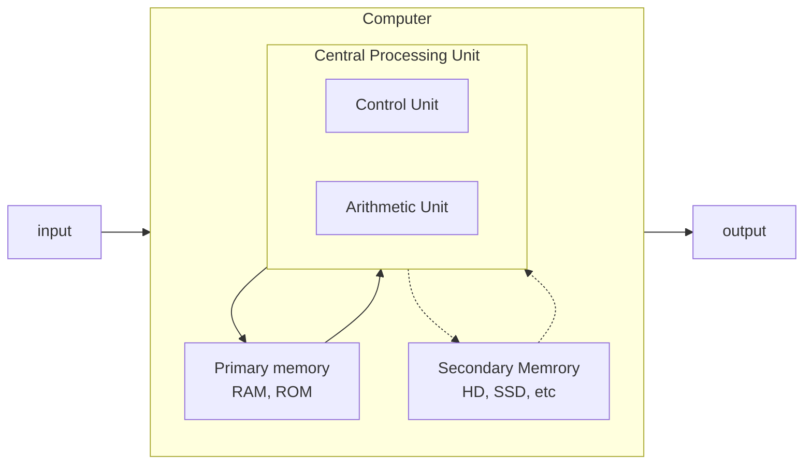

<!-- 
TODO: Von Newmann para computadores: https://commons.wikimedia.org/wiki/File:Computer_Systems_-_Von_Neumann_Architecture_Large_poster_anchor_chart.svg

TODO: Pegar o mermaid do Von Newmann e transformar em clássico denovo.
 -->

# Computer Architecture

## General topics

- Paging - In OS, it is a memory scheme by which a computer stores and retrieves data form a secondary storage for use in main memory. 

### Curiosities

Why binary conversion is right to left?

- In practical terms, the numbers on the left represent a greater value.

## Von Neumann Architecture



*Image: Von Newmann Archtecture. Based on Wikipedia*

## Number representations

- Binary(0-1)

- - Ex. (0101)2

- Octal (0-7)

- - Ex. (174640)8

- Decimal (0-9)

- - 1303 = 1e1+3e2+0e3+3e4
  - Ex. (189370)10

- Hexadecimal (0-9,A-F) m.q. 0-15

- - Ex. (f0f0f0)16

### Ways to calc

- Base 10

  - <pre>... 111111 = ... * 32 * 16 * 8 * 4 * 2 * 1</pre>

- Base 8 - split by 3

  - <pre>(10.101)2 = (25)8</pre>

- Base 16 - split by 4

  - <pre>(1.0101)2 = (51)16</pre>


## Binary arithmetic

Number types:

| Written          | Numeral | Algorithmic |
| ---------------- | ------- | ----------- |
| Twenty           | 20      | 2, 0        |
| Twelve           | 12      | 1, 2        |
| Twenty and three | 23      | 2, 3        |

### Sum

Simple examples:

```
0 + 0 = 0
0 + 1 = 1
1 + 1 = 0
1 + 1 = 10
 
11 + 01 = 00
```

### Subtraction

### Multiplication

### Division

### Exercises:

Sum

```
1) 10111 + 111
   10111
+) 11
+  111
= 110011

2) 101.11 + 10.100
   10111 	(.2)
+)  1   
+  10100 	(.3)
= 101011	(.3)
= 101.011
```

Subtraction

```
1) 1011 - 11
  1011
-)    
-   11
= 1000 

2) 10.001 - 1.1
  10001		(3)
-)111  
-    11		(1)
= 01110		(4)
= 0.1110
```

Complement subtraction

```
1) 1011 - 11
```

Multiplication

```
1) 1011 * 11
   1011
x     11
=   1011
+) 111  
+  1011
= 100001

2) 100.01 * 1.011

```

Division

```
1) 10111 + 111

2) 1011.01 / 1.1

```


## Source:

* [Binary calculator - AtoZmath](https://atozmath.com/NumberOperation.aspx?q=2&op=4&q1=1110`100`4`3`2`2&do=1#PrevPart)

* [Memory paging - Wikipedia](https://en.wikipedia.org/wiki/Memory_paging)
