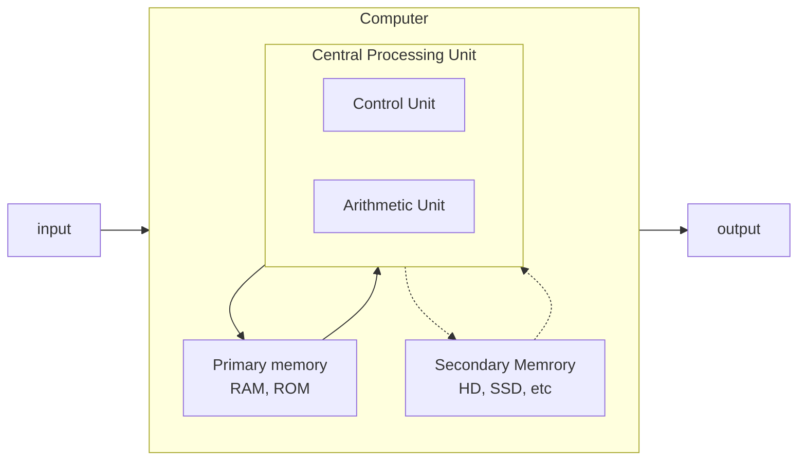

<!-- 
TODO: Von Newmann para computadores: https://commons.wikimedia.org/wiki/File:Computer_Systems_-_Von_Neumann_Architecture_Large_poster_anchor_chart.svg

TODO: Pegar o mermaid do Von Newmann e transformar em clássico denovo.
 -->

# Computer Architecture

## General topics

- Paging - In OS, it is a memory scheme by which a computer stores and retrieves data form a secondary storage for use in main memory. 

### Curiosities

Why binary conversion is right to left?

- In practical terms, the numbers on the left represent a greater value.

## Von Neumann Architecture



*Image: Von Newmann Archtecture. Based on Wikipedia*

## Number representations

- Binary(0-1)

- - Ex. (0101)2

- Octal (0-7)

- - Ex. (174640)8

- Decimal (0-9)

- - 1303 = 1e1+3e2+0e3+3e4
  - Ex. (189370)10

- Hexadecimal (0-9,A-F) m.q. 0-15

- - Ex. (f0f0f0)16

### Ways to calc

- Base 10

  - <pre>... 111111 = ... * 32 * 16 * 8 * 4 * 2 * 1</pre>

- Base 8 - split by 3

  - <pre>(10.101)2 = (25)8</pre>

- Base 16 - split by 4

  - <pre>(1.0101)2 = (51)16</pre>


## Binary arithmetic

Number types:

| Written          | Numeral | Algorithmic |
| ---------------- | ------- | ----------- |
| Twenty           | 20      | 2, 0        |
| Twelve           | 12      | 1, 2        |
| Twenty and three | 23      | 2, 3        |

### Sum

Simple examples:

```
0 + 0 = 0
0 + 1 = 1
1 + 1 = 0
1 + 1 = 10
 
11 + 01 = 00
```

### Subtraction

### Multiplication

### Division

### Exercises:

Sum

```
1) 10111 + 111
   10111
+) 11
+  111
= 110011

2) 101.11 + 10.100
   10111 	(.2)
+)  1   
+  10100 	(.3)
= 101011	(.3)
= 101.011
```

Subtraction

```
1) 1011 - 11
  1011
-)    
-   11
= 1000 

2) 10.001 - 1.1
  10001		(3)
-)111  
-    11		(1)
= 01110		(4)
= 0.1110
```

Complement subtraction

```
1) 1011 - 11
```

Multiplication

```
1) 1011 * 11
   1011
x     11
=   1011
+) 111  
+  1011
= 100001

2) 100.01 * 1.011

```

Division

```
1) 10111 + 111

2) 1011.01 / 1.1

```

## Assembly

### install

* http://masm32.com

### Read and write

LA - Load address.

LI - load input, Read.

Write 
1. Int
2. Float
3. Double
4. String

Read

5. Int
6. Float 
7. Double
8. String

System

9. Break
10. Encerra 


### operators

Subtraction:

* AL = r1 - r2

Division:

* AL/r2 = AX % AH
* `ADD, dest, orig`

```assembly

```

### Conditional

```
cmp DEST, ORIG
je labTRUE      ;if DEST == ORIG goto labTRUE

...             ; false
li $v0, 10
syscall

labTrue
...             ; true
li $v0, 10
syscall
```

* je - jump equal. `=`
* jne - jump not equal. `!=`
* ng - jump greater. `>`
* jne - jump greater equal. `>=`
* ng - jump lesser. `<`
* jne - jump lesser equal. `<=`

### Exercise

1. Read decimal float and print its double.
   ```assembly
    li 5v0, 6
    syscall
    la %R7, 0($v0)

    mov R1, $R7
    mov al, R1

    mul 2
    mov R1, AX

    mov $F12, R1
    li $v0, 2
    syscall

    li $v0, 2
    syscall
   ```

2. Read two integers, show the rest of division between them.

    ```assembly

    ```

3. Read int, float, show multiplication and subtraction between them.

    ```
    ;read int R1
    li $v0, 5       ;load input int
    syscall
    la $t7, 0($v0)  ;load address
    mov r1, $t7

    ;read float R2
    li $v0, 6       ;load input float
    syscall
    la $t7, 0($v0)  ;load address
    mov r2, $t7

    ;AX = AL*r2
    mov al, r1
    mul r2
    mo r3, ax

    ;print float r3
    mov $t7 r3
    la $f12, $t7
    li $v0, 2       ;print float
    syscall

    ;r1 = r1 - r2
    sub r1, r2

    ;print float r1
    mov $t7, r1
    la $f12, $t7
    li $v0, 2       ;print float
    syscall
    ```

4. Receive two integers and show the greather.

    ```
    ; read int R1
    li $v0, 5        ;load input int
    syscall
    la $t7, 0($v0)
    mov r1, $t7

    ;read int R2
    li $v0, 5        ;load input int
    syscall
    xx


    ```

5. Receive a number and show if it's even or odd.

    ```
    ; read int r1
    li $v0, 5
    syscall
    la $t7, 0($v0)
    mov r1, $t7

    ;ah = r1/2          ;AL/2 = AX % AH
    mov al, r1
    div 2

    ; if ah != 0 goto NOT_ZERO
    cmp ah
    jne NOT_ZERO

    mov $t7, "odd"
    jmp PRINT
    
    NOT_ZERO
    mov $t7, "even"
    jmp PRINT

    PRINT
    la $a0, $t7
    li $v0,4
    syscall

    ;quit
    li $v0, 10
    syscall
    ```

6. Receive twot numbers, if the first is greater show its product, otherwise show its sum.

    ```
    li $v0, 5       ;read int r1
    syscall
    la $t7, 0($v0)
    mov r1, $t7

    li $v0, 5       ;read int r2
    syscall
    la $t7, 0($v0)
    mov r2, $t7

    cmp r1, r2      ;if r1>r2 goto GREATER
    jg GREATER

    add r1, r2      ;r1 = r1 - r2
    jmp PRINT

    GREATER
    ;r1 = r1*r2     ;al*r2=ax
    mov al, r1
    mul r2
    mov r1, ax
    jmp PRINT

    PRINT
    la $a0, r1
    li $v0, 1
    syscall
    ```

7. Calculate the sphere volume: V=(4/3)3.14*R. Get the 

    ```
    ;read float r1
    li $v0, 6
    syscall
    la $t7, 0($v0)
    mov r1, $t7

    ;v = ((4/3)*3.14) * R   ;r2 = r2 * r1
    
    ;r2 = 4/3               ;al/r2 = ax % ah
    mov al, 4
    div 3
    mov r2, ax

    ;r2 = r2*3.14           ;al*r2 = ax
    mov al, r2
    mul 3.14
    mov r2, ax

    ;r1 = r2*r1
    mov al, r2
    mul r1
    mov r2,  ax

    ;print float r2
    la $a0, r2
    li v0, 2
    ```

## Source:

* [Binary calculator - AtoZmath](https://atozmath.com/NumberOperation.aspx?q=2&op=4&q1=1110`100`4`3`2`2&do=1#PrevPart)

* [Memory paging - Wikipedia](https://en.wikipedia.org/wiki/Memory_paging)
