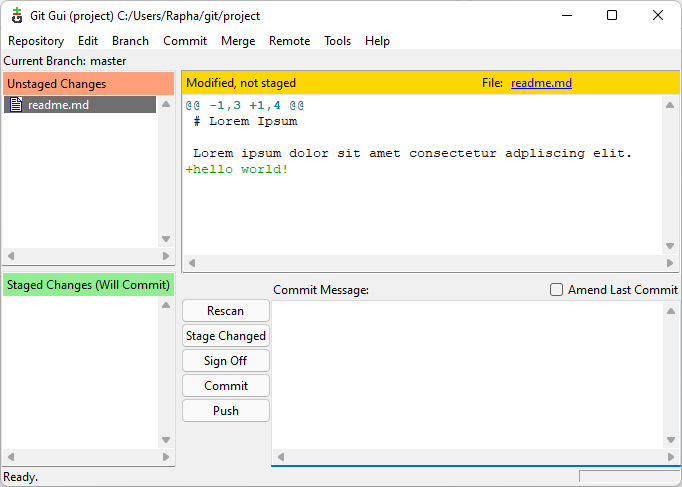
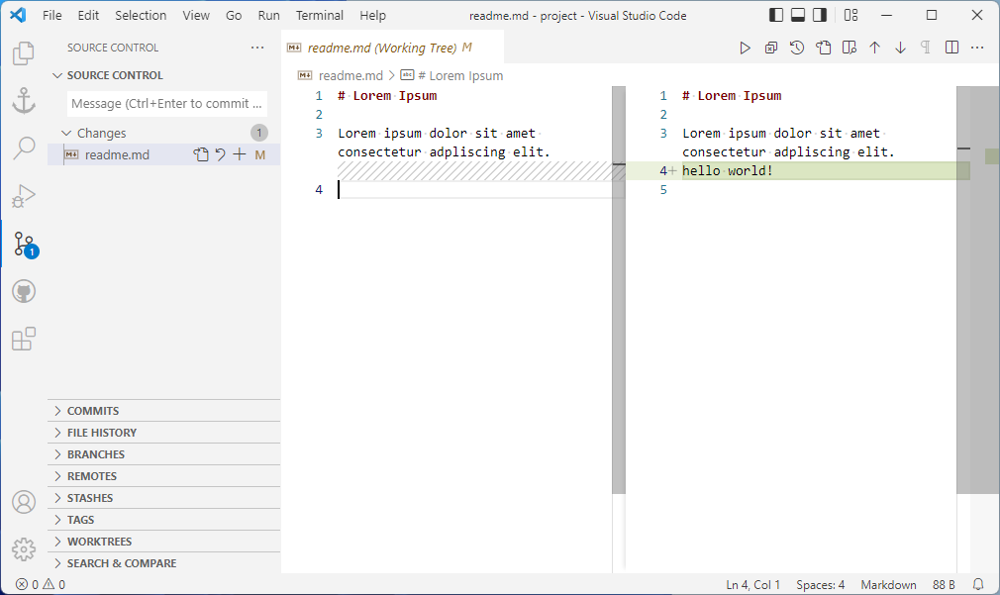
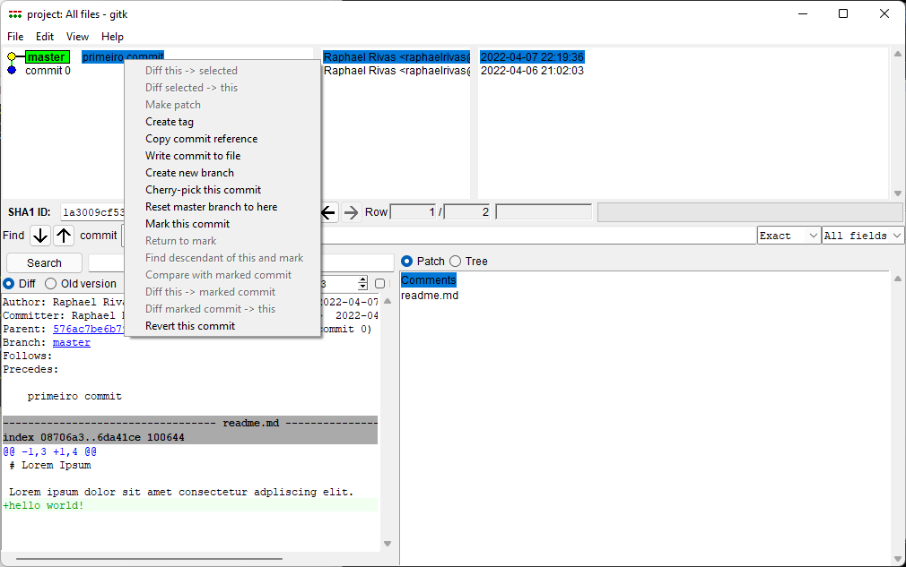

# Aula 3

## Visualizar alterações na pasta de trabalho:

:warning: Isto exibe apenas as alterações feitas em arquivos modificados na working dir.

```bash
git diff
```

### Retorno:

Git Bash:

```git
$ git diff
diff --git a/readme.md b/readme.md
index 08706a3..6da41ce 100644
--- a/readme.md
+++ b/readme.md
@@ -1,3 +1,4 @@
 # Lorem Ipsum

 Lorem ipsum dolor sit amet consectetur adpliscing elit.
+hello world!
```

Equivalente no Git GUI:



Equivalente no VSCode:



## Visualizar alterações na sala de preparação:

> Mostra apenas alterações de arquivos modificados, que estejam na **staging area**.
> 
> Ou seja, os arquivos afetados pelo o `git add`, que ainda não foram confirmados (commited).

```bash
git diff --staged
```

## Visualizar commits:

```git
git log
```

Retorno:

```git
commit 576ac7be6b79d4e260ac9be5291134e88761854f (HEAD -> master)
Author: Raphael Rivas <raphaelrivas@hotmail.com>
Date:   Wed Apr 6 21:02:03 2022 -0300

    commit 0
```

## Visualizar commits com as alterações feitas:

:warning: Isto exibirá TODOS os commits do projeto. Em projetos grandes o log pode ser gigantesco!

```git
git log -p
```

Retorno:

```git
commit 576ac7be6b79d4e260ac9be5291134e88761854f (HEAD -> master)
Author: Raphael Rivas <raphaelrivas@hotmail.com>
Date:   Wed Apr 6 21:02:03 2022 -0300

    commit 0

diff --git a/readme.md b/readme.md
new file mode 100644
index 0000000..08706a3
--- /dev/null
+++ b/readme.md
@@ -0,0 +1,3 @@
+# Lorem Ipsum
+
+Lorem ipsum dolor sit amet consectetur adpliscing elit.
```

O retorno é literalmente o `git log` + `git diff`.

> :warning: (Windows) Caso use o comando `git log -p` fora do Git Bash,  ele abrirá o VIM para exibir o log, ao invés de imprimir e encerrar o comando automaticamente.
> 
> Para sair do VIM pressione `:q`.

## Visualizar commits com alterações, mas apenas alguns:

```git
git log -p -1
```

> O -1 significa que exibirá apenas 1 commit.
> 
> Se quiser exibir 3 você digita `git log -p -3`, e assim por diante.

## Gitk - Navegador de repositório do Git:

*Uma versão gráfica do git log*

```git
gitk
```

Ele exibe uma interface gráfica que lembra o Git GUI:



Ele exibe todos os commits. Em cada commit ele exibe todos os detalhes, inclusive as alterações de cada arquivo.

> :exclamation: Isto não é um gerenciador de repositório!  Apenas gerencia commits, nada muito alem disso.
> 
> Ele não cria novos commits, adiciona arquivos nem nada disso. Se procura por isso, tente o Git GUI ou VSCode.

### Funções do Gitk:

> Em suma: commits em geral.

* Criar tag
  
  > exemplo de tag: `v1.0`, `v1.1`

* Visualizar commits, seus IDs;

* Reverter commit;

* Criar ramificação (branch).

## Fontes:

* [**gitk Documentation** - Git](https://git-scm.com/docs/gitk/)

* [**git-gui Documentation** - Git](https://git-scm.com/docs/git-gui/)

* [**Tagging** - Git](https://git-scm.com/book/en/v2/Git-Basics-Tagging)
