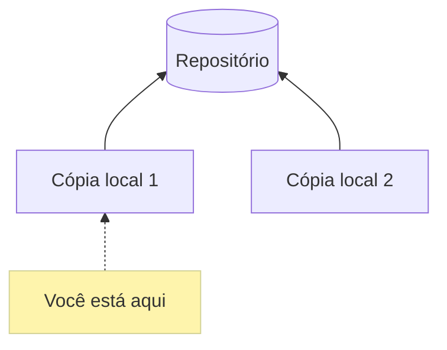
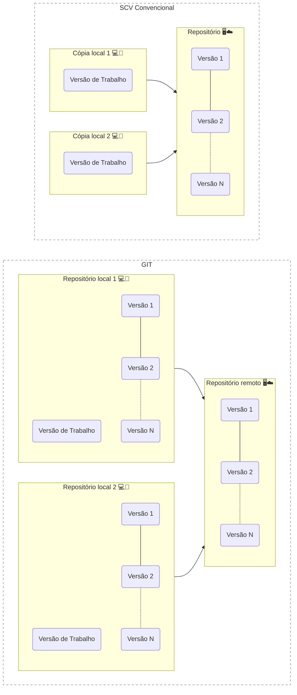
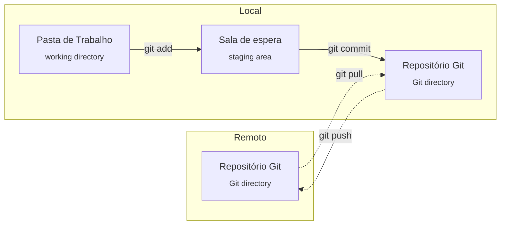

*Read this in other languages: [English](../../lesson-1.md), [português](lang/pt/lesson-1.pt.md)*

# Aula 1

Esta aula fala sobre o que é Git e o básico de como funciona.

## Git é um sistema de controle de versão

Git é um **sistema de controle de versão** desenvolvido por Linux Torvalds.

Um sistema de controle de versão é um sistema que gerencia um ou mais arquivos para poder salvar e desfazer alterações sempre que quiser.

Outra vantagem deste sistema é várias pessoas poderem trabalhar ao mesmo tempo, pois cada usuário tem sua versão local, enquanto a versão oficial está intacta no repositório principal.

Funcionamento de um sistema de controle de versão:



## Por que usar Git?

O diferencial do Git para outros sistemas de controle de versão é que o **Git é um sistema distribuido**, descentralizado. Os outros sistemas normalmente são (mais) centralizados, com outro foco.

SCV convencional vs Git:



No Git você baixa todo o conteúdo do repositório no seu PC, assim não precisa toda hora acessar a internet para ver todos os arquivos.

O Git é distribuído pois toda alteração que você enviar para o  repositório poderá ser baixada pelas outas máquinas, compartilhando as versões com todos.

## Como usar o Git

No Git você tem 3 etapas para seus arquivos:

1. **Pasta de trabalho (working directory):**
   
   * Contém os arquivos locais, você pode editar a vontade que não vai danificar o repositório.

2. **Sala de espera (staging area):**
   
   * Quando você quiser enviar os arquivos para o repositório, você primeiro marca os arquivos desejados para o envio. Exemplo: `git add teste.txt`.

3. **Repositório Git (Git directory):**
   
   * É uma pasta chamada `.git`, que está presente em todo projeto.
   * Ela contém todas as configurações do Git.
   * Quando você estiver pronto, pode confirmar as alterações para o teu repositório local.
     * Após isso é possível aplicar as alterações no repositório remoto.
   
   > Repositório Git é também chamado de:
   > 
   > * Diretório Git;
   > - Pasta do Git;
   > 
   > - Banco de dados interno do Git;
   > 
   > - Banco de dados dos Objetos Git (registros de arquivos, seus endereços, chaves, etc).
   > 
   > Portanto, se estranhar esses nomes, saiba que é a mesma coisa!

Estágios do Git:



## Instalando Git

Há várias maneiras de instalar:

### Via GitHub

Caso vá usar o GitHub ou [GitLab](https://about.gitlab.com/) e gosta de praticidade, simplesmente baixe o `GitHub desktop` ou `GitHub cli`, eles baixam a última versão do Git automaticamente.

* GitHub Desktop: https://desktop.github.com/
  
  * Winget (Windows):
    
    ```powershell
    winget install github-desktop
    ```

* GitHub Cli: https://cli.github.com/
  
  * Winget (Windows):
    
    ```powershell
    winget install github-cli
    ```

### Direto da fonte

* Site oficial: https://git-scm.com/

* Winget (Windows):
  
  ```powershell
  winget install git -e
  ```

* PopOS, Ubuntu, Debian, e derivados:
  
  ```bash
  sudo apt install git
  ```

## Configurações iniciais

### Defina seu nome de usuário e email

Este será seu nome público em cada nova alteração feita em repositórios.

Após instalar o Git, ele tentará usar o nome de usuário genérico, talvez ele use o nome de usuário do seu SO e um email modelo (exemplo: `username@git.com`).

Para definir seu nome:

```git
git config --global user.name "Meu Nome"
```

Para definir seu email:

```git
git config --global user.email "usuario@email.com"
```

> Susbtitua "meu nome" e "usuario@email.com" por seus usuário e email desejados.

### Para ver as configurações atuais do Git

```git
git config --list
```

Ele vai exibir o texto das configurações num editor de texto chamado **VIM**.

- Para navegar use as setas :arrow_up: :arrow_down:.

- Para sair digite `:q` e tecle `ENTER` :leftwards_arrow_with_hook:

## Fontes

- [Recording Changes to the Repository - Git](https://git-scm.com/book/en/v2/Git-Basics-Recording-Changes-to-the-Repository)
- [Qual a diferença entre repositório, diretório e pasta? - Alura](https://cursos.alura.com.br/forum/topico-qual-a-diferenca-entre-repositorio-diretorio-e-pasta-117341)
- [What is the difference between working directory and repository - Medium](https://medium.com/tech-journey-with-anna/git-question-what-is-the-difference-between-the-working-directory-aka-workspace-and-the-eeee15b7e4b3)

Referência para tradução de working directory, staging area e git directory:

- [Documentação - Git](https://git-scm.com/docs/git/pt_BR)
