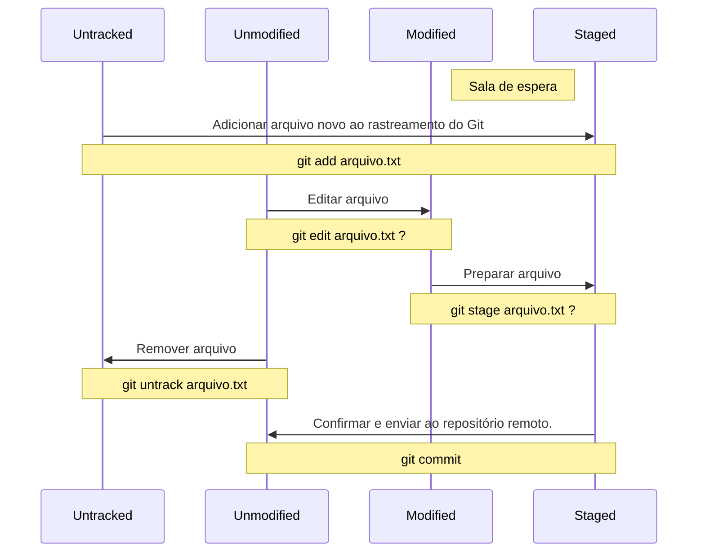

# Aula 2

xx

### Ciclo de vida dos status (simplificado):



[Git - Recording Changes to the Repository](https://git-scm.com/book/en/v2/Git-Basics-Recording-Changes-to-the-Repository)

Outras fontes:

* [Cloud savvyit]([How To Completely Reset a Git Repository (Including Untracked Files) &#8211; CloudSavvy IT](https://www.cloudsavvyit.com/14460/how-to-completely-reset-a-git-repository-including-untracked-files/)

xx

# Aula 2

#### Criar repositório:

```git
git init
```

Feito isto aparecerá uma pasta chamada `.git`, lá contém todas as configurações do git.

### A pasta .Git:

Contém todas as configurações do Git.

Ela é também chamada por vários nomes:

* Banco de dados interno do Git
* Banco de dados dos Objetos Git (registros de arquivos, seus endereços, chaves, etc)

### Ver status do repositório:

```git
git status
```

### Status de arquivos no Git:

#### Untracked:

Não rastreado.

* Quando arquivos são criados o Git tem ciência que eles existem porém ainda não foram salvos em seu banco de dados interno (Na pasta `/.git`).

###### Adicionar arquivo ao rastreamento do Git:

```git
git add arquivo.txt
```

#### Unmodified:

Não modificado.

#### Modified:

Modificado.

Contém as mudanças modificadas. É a sala de espera dos arquivos para serem preparados.

#### Staged:

Preparado.

## Fontes

* [How To Completely Reset a Git Repository – CloudSavvy IT](https://www.cloudsavvyit.com/14460/how-to-completely-reset-a-git-repository-including-untracked-files/)
