# Aula 2

Para fins de aprendizado, o cenário adotado pelo professor será de um único usuário gerenciando o repositório.
Uma pessoa trabalhando sozinho e localmente, gerenciando seus projetos.

Ao instalar o Git você tem dois programas: Git Bash e Git GUI.

É possível usar o Git de várias maneiras, em destaque:

1. Git (terminal)

2. Git Bash

3. Git GUI

4. VSCode

Qual usar?

1. Git Bash - Todos os comandos estão lá, qualquer problema você saberá usar os comandos.

2. VSCode - No dia-a-dia, se você quer praticidade e agilidade, provavelmente preferirá usar dentro do VSCode. Na maioria das atividades é possível usar perfeitamente o Git no VSCode.
   
   A Microsoft criou integração, por padrão, do VSCode com o Git (e GitHub). Ele já vem pronto para usar Git.

## Git (terminal)

Este é o Git original, o Git cru!
Um conjunto de comandos de terminal que executam o sistema de controle de versão Git.

Git foi projetado para rodar em ambientes tipo-Unix (Linux, macOS, etc).

Por este motivo, **o Git cru, no Windows, possui má integração ao usar comandos**, alguns podem não funcionar como deveriam **(como o `git log -p`, gerar chaves SSH, entre outros)**.

É por isso que no Windows há (e recomenda-se) o Git Bash.

## Git Bash

Git Bash emula, no Windows, todo o ambiente Unix necessário para o Git rodar perfeitamente, sem erros. 

Há três maneiras de abrir o Git Bash:

### Via aplicativo:

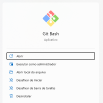

Por este método o programa abre por padrão na pasta de usuário (`~/`).

#### Alterando a pasta padrão:

Para alterar a pasta padrão é preciso alterar o comando de inicialização do app, no atalho do Git Bash:

(Windows)

1. Vá no iniciar pesquise pelo programa e abra seu local do arquivo:
   
   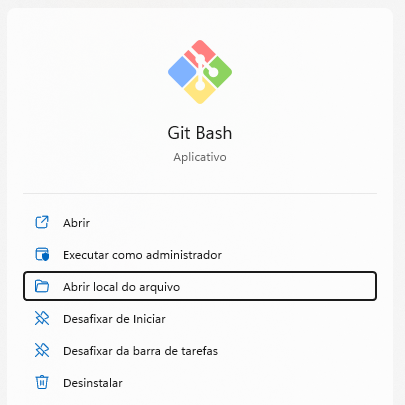

2. Clique no atalho do Git Bash e vá em **Propriedades**:
   
   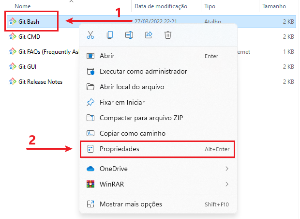

3. Mude a pasta de destino para a pasta desejada usando o comando a seguir:
   
   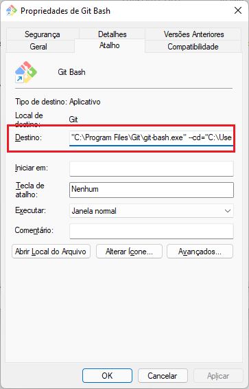
   
   Comando:
   
   ```bash
   "C:\Program Files\Git\git-bash-exe" cd="NOVO ENDEREÇO"
   ```

> O professor sugeriu simplesmente inserir o novo endereço na seção `Iniciar em`, contudo nos testes realizados não foi possível obter sucesso:
> 
> 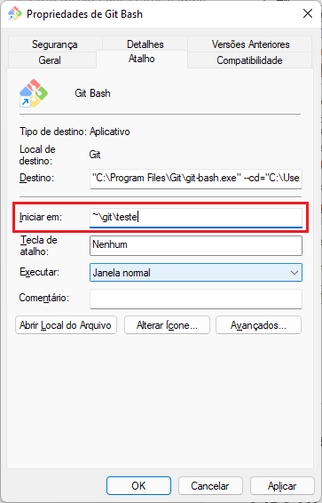
> 
> Caso queira tentar, pode inserir diretamente o novo endereço na seção `Iniciar em`.

### Via Explorador de Arquivos (Windows)

O Git Bash abrirá automaticamente no endereço atual do Explorador de Arquivos.

   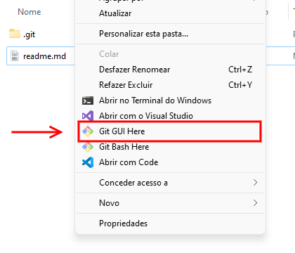

### Via terminal do VSCode

É possível usar os comandos `git`  fora do git-bash, apenas usando 

## Git GUI

A tela inicial mostra o básico:

* Criar novo repositório

* Clonar ou abrir repositório existente

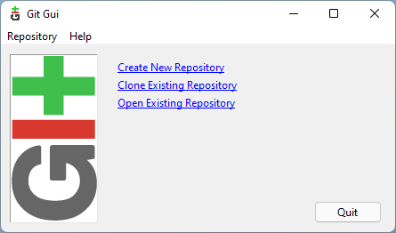

### Gerenciar chave SSH

Em `Help > Show SSH Key` é possível adicionar e gerenciar sua chave SSH.

Esta chave serve para você se autenticar e acessar repositórios privados, por exemplo.

### Gerenciando repositório:

:warning: Importante!

**Os arquivos** novos, alterados ou removidos **não vão aparecer** no Git GUI a menos que você use a função Rescan  (`F5`) toda vez.

Sim, toda vez é necessário usar Rescan para atualizar este aplicativo sobre os arquivos que existem no Git.

**Isto não é uma característica do Git!**
É uma característica do aplicativo Git GUI, não do Git em si. Caso use Git Bash, VSCode, etc, fique tranquilo quanto a isso.

Git GUI mostrando o repositório:

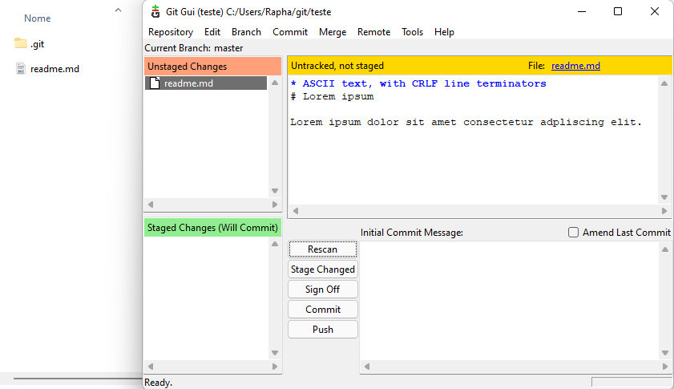   

A janela contém cinco botões principais no meio da janela:

* Rescan
  
  Toda alteração, adição, remoção de arquivo só será mostrada na janela ao clicar aqui.
  
  * **Atalho**: `F5`;
  
  * **Menu**: Commit > Rescan;
    
    > Reforçando, a função Rescan é uma característica apenas do Git GUI.
    > 
    > O Git bash e qualquer outro, já fazem isso automaticamente!

* Stage Changed
  
  Prepara arquivo para alteração.
  
  * **Atalho:** `Ctrl T`;
  
  * **Menu:** Commit > Stage to Commit.

* Sign off
  
  Mostra a assinatura que aparecerá no final de cada commit.
  
  Útil para identificar, de forma legível, quem fez o envio das alterações.

* Commit
  
  Aplica as alterações no repostório local.
  
  - **Atalho:** `Ctrl T`;
  
  - **Menu:** Commit > Stage to Commit;
  
  - **Comando equivalente**: `git commit`.

* Push
  
  Envia as alterações para um repositório remoto (exemplo: GitHub).
  
  - **Atalho:** `Ctrl T`;
  
  - **Menu:** Commit > Stage to Commit;
  
  - **Comando equivalente**: `git push`.

Também há uma função útil **que não possui botão**, e vale a pena destacar:

* Unstage From Commit
  
  > O oposto da função `Stage Changed`
  
  Despreparar arquivo da sala de espera.
  
  - **Atalho:** `Ctrl U`;
  
  - **Menu:** Commit > Unstage From Commit.
  
  - **Comando equivalente**: `git reset --staged`.

## Git VSCode

O VSCode possui por padrão integração com o Git (e GitHub), é extremamente simples de usar, será mostrado o essencial da ferramenta.

Criando um repositório:

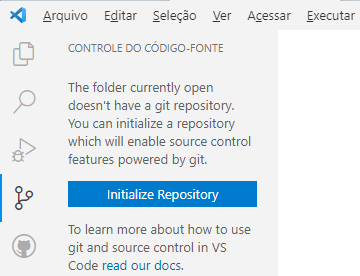

Preparar alterações (stage):

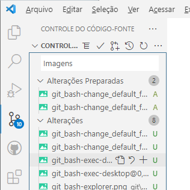

Despreparar alterações:

* Comando equivalente: `git reset`

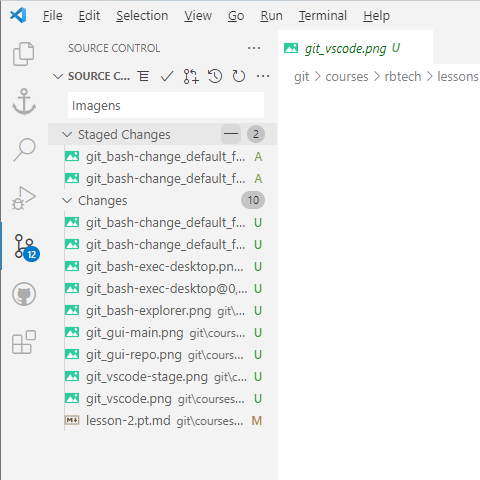

Confirmar alterações no repositório local:

* Comando equivalente: `git commit`

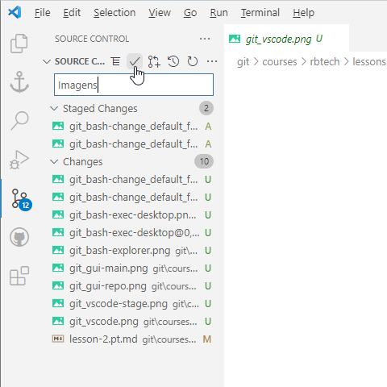

Enviar alterações para o repositório remoto:

* Comando equivalente: `git push`

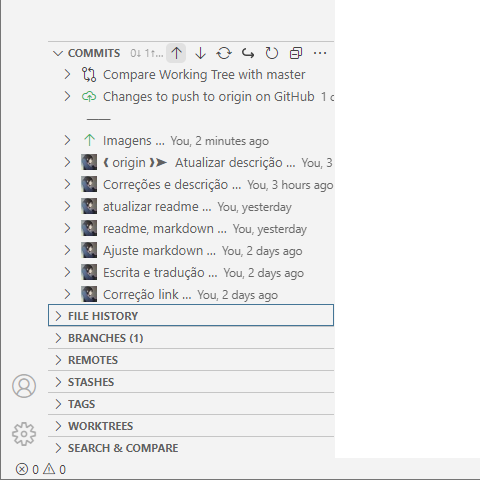

Desfazer confirmações (commits) no repositório local:

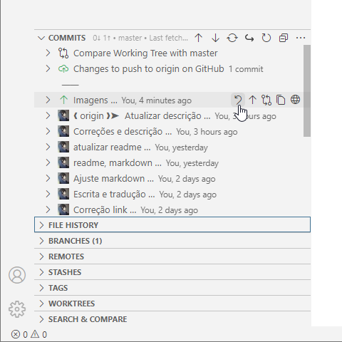

## Navegando no terminal (Git Bash, Linux, macOS)

Em praticamente todos os terminais usa-se certos comandos para navegar pelas pastas:

### Ver pastas:

```bash
ls
```

### Entrar na pasta:

```bash
cd pasta
```

### Sair da pasta:

```bash
cd ..
```

### Subir de pasta mais de uma vez:

```bash
cd ../../..
```

Neste caso subimos 3 pastas.

### Abrir endereço:

```bash
cd /c/users/public
```

Neste exemplo entramos na pasta de usuário público do Windows.

## Comandos Git

Funciona no Git Bash ou Git terminal (windows).

### Recaptulando

Configurar email:

```bash
git config -- global user.name "Nome Sobrenome"
```

Configurar senha:

```bash
git --config global user.email "email@provedor.com"
```

### Criando repositório

```bash
git init
```

Depois que você cria um repositório, você já pode adicionar seus arquivos normalmente.

Aparecerá uma pasta chamada `.git`, lá contém todas as configurações do git.

Tudo o que vem depois é para sincronizar estes arquivos com o repositório.

#### Ver a situação do repositório:

```bash
git status
```

Esta função exibe uma lista de pendências e também os comandos necessários.

Quando o git tiver arquivos pendentes ele mostrará, respectivamente:

* Ramos (branch) não publicados;
  
  > Ramos do repositório local não publicados para o repositório remoto

* Alterações não confirmadas;
  
  > Arquivos que pecisam ser confirmados (commit) no repositório local.

* Arquivos existentes não preparados;
  
  > Arquivos (novos ou velhos) não enviados para a sala de espera (staging area).

* Arquivos novos não preparados.
  
  >  Arquivos novos não rastreados pelo repositório local.
  > 
  > Uma vez rastreados eles também vão para a sala de espera.

Resposta do terminal:

```git
On branch master
Your branch is ahead of 'origin/master' by 1 commit.
  (use "git push" to publish your local commits)

Changes to be committed:
  (use "git restore --staged <file>..." to unstage)
        new file:   ~/git/teste/readme.md

Changes not staged for commit:
  (use "git add <file>..." to update what will be committed)
  (use "git restore <file>..." to discard changes in working directory)
        modified:   ~/git/teste/code-1.cpp
        modified:   ~/git/teste/code-2.cpp

Untracked files:
  (use "git add <file>..." to include in what will be committed)
        modified:   ~/git/teste/code-3.cpp
```

### Gerenciando arquivos

Na pasta de trabalho (working directory):

#### Preparar arquivo (stage):

> Adiciona arquivos novos ou alterados para a sala de espera (Staging area)

```bash
git add arquivo.txt
```

Preparar todos os arquivos:

```bash
git add -A
git add .
```

Na sala de espera (staging area):

#### Despreparar arquivo (unstage):

> Remove arquivos da sala de espera (staging area) de volta para a pasta de trabalho (working directory).

```bash
git reset arquivo.txt
git reset arquivo.txt
```

Despreparar todos os arquivos:

```bash
git reset -A
git reset.
```

#### Despreparar e desfazer alterações no arquivo:

```git
git restore
```

#### Confirmar arquivo:

```bash
git commit
```

Ao dar commit, uma tela do editor de texto `VIM` aparecerá:

##### Mensagem de commit (VIM):

```vim
|
# Please enter the commit message for your changes. Lines starting
# with '#' will be ignored, and an empty message aborts the commit.
#
# On branch master
# Changes to be committed:
#       new file:   teste.txt
#
~
~
~
</Users/Rapha/git/project/.git/COMMIT_EDITMSG [unix] (23:26 07/04/2022)1,0-1 All
"C:/Users/Rapha/git/project/.git/COMMIT_EDITMSG" [unix] 8L, 210B
```

> Você irá escrever uma mensagem de commit na primeira linha, então você irá salvar e sair.
> 
> Para editar o texto no VIM, primeiro entraremos no modo de inserção, pressionando `i`.

Modo inserção:

```vim
i
```

> Agora digite sua mensagem de commit na primeira linha.
> 
> Quando terminar, tecle `Esc`.

Sair do modo de inserção:

```VIM
Esc
```

> Para salvar, você irá sobrescrever o arquivo através do comando `:w`, e teclar `Enter`.

Sobrescrever (salvar arquivo existente):

```vim
:w
```

> A mensagem de commit está feita, podemos sair.

Sair:

```vim
:q
```

##### Não gosto do VIM, quero outro editor de texto!

```git
git config --global core.editor "notepad"
```

> Neste exemplo mudamos para o notepad, você pode mudar para o nano, VSCode ou qualquer outro. 

No repositório local:

#### Desconfirmar arquivo (uncommit):

> Cria um novo commit que irá reverter as mudanças de outro commit.
> 
> É necessário o código do commit.

```bash
git revert 085bb3bcb608e1e8451d4b2432f8ecbe63
```

Ver commits e obter código:

```bash
git log
```

#### Publicar commit no servidor remoto

> Push = empurrar

```bash
git push
```

#### Baixar mudanças do servidor remoto:

> Pull = puxar

```bash
git pull
```

### Ignorar arquivos da detecção do Git:

Se deseja que o Git não avise nem te cobre sobre um certo arquivo, há duas maneiras:

* exclude

* .gitgnore

Ambos arquivos usam a mesma sintaxe. Veja este exemplo:

#### Exclude (recomendado):

É recomendado para a maioria dos casos pois são requisitos que ficam salvos apenas no seu PC. Isto não irá para outros repositórios.

Abra o arquivo `.git/info/exclude` para editar.

#### .gitgnore:

Em alguns casos é interessante sincronizar as regras para excluir arquivos, para isso é usado o `.gitgnore`

Crie, na pasta principal de seu projeto, um arquivo chamado `.gitgnore` para editar.

#### Sintaxe do exclude e .gitgnore:

Veja este exemplo e siga:

```git
# Isto é um comentário!
# Excluir tudo que contém o termo temp
*temp*
# Excluir arquivos .exe
*.exe
# Excluir uma pasta específica
*temp/info
# Excluir um arquivo específico
*temp/info/teste.txt
# Excluir arquivos que comecem com 'beta'
beta*
```

## Resumindo os principais comandos:

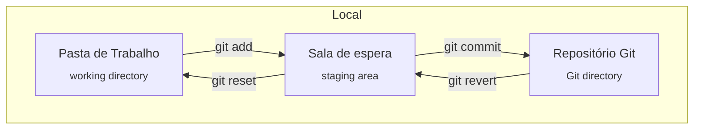

## Fontes

* [**How To Completely Reset a Git Repository** - Cloud Savvy IT](https://www.cloudsavvyit.com/14460/how-to-completely-reset-a-git-repository-including-untracked-files/)

* [**Why Git is Better than X** - Z.GitHub.io](Why Git is Better Than X](https://z.github.io/whygitisbetter/)

* [**Working on Git for GUI** - GeeksforGeeks](https://www.geeksforgeeks.org/working-on-git-for-gui/) 

* [**git commit - What is the Sign Off feature in Git for?** - StackOverflow](https://stackoverflow.com/questions/1962094/what-is-the-sign-off-feature-in-git-for)

* [**Git Bash: Getting Started with Git on Windows** - Git Tower](https://www.git-tower.com/learn/git/faq/git-bash)

* [**Como usar a integração do Git no Visual Studio Code** - DigitalOcean](https://www.digitalocean.com/community/tutorials/how-to-use-git-integration-in-visual-studio-code-pt)

* [**Most basic Git commands** - RubiGarage](https://rubygarage.org/blog/most-basic-git-commands-with-examples)

* [**What is the `git restore` command and what is the difference between `git restore` and `git reset`?** - StackOverflow](https://stackoverflow.com/questions/58003030/what-is-the-git-restore-command-and-what-is-the-difference-between-git-restor)

* [**Viewing the Commit History** - Git](https://git-scm.com/book/en/v2/Git-Basics-Viewing-the-Commit-History)
