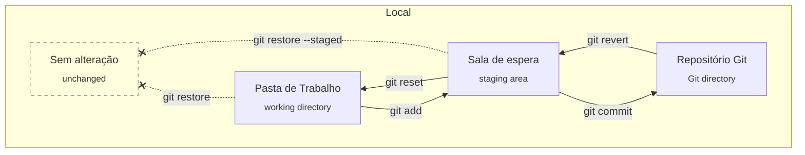

# Aula 4

Alguns comandos serão repetidos, para fins de fixação ou porque foram adicionados antes do professor ensinar.

## Outras maneiras de usar commit

### Confirmar apenas arquivos rastreados:

Em outras palavras, todos os arquivos exceto os novos.

```git
git commit -a
```

> Tracked pode ser traduzido como:
> 
> * rastreado (tradução pessoal)
> 
> * controlado (tradução oficial da Microsoft no VSCode)

### Confirmar com mensagem:

Mais prático que abrir editor de texto toda vez.

```git
git commit -m "mensagem de commit"
```

## Visualizar commits, apenas código e mensagem:

```git
git log --pretty=oneline
```

Retorno:

```git
4c593d5807314d465d00947783ce683bc472153c (HEAD -> master) outro commit
1a3009cf53aad6759a3708eb7b482886c10a9a41 primeiro commit
576ac7be6b79d4e260ac9be5291134e88761854f commit 0
```

## Editar commit:

:warning: **QUAISQUER arquivos preparados (`git add`) após o commit anterior, serão incluídos no novo commit editado.**

Não é apenas o nome que é alterado. 

### Editar commit e mensagem:

```git
git commit --amend
git commit --amend -m = "novo nome"
```

Retorno: (`git commit --amend`)

```git
outro commit

# Please enter the commit message for your changes. Lines starting
# with '#' will be ignored, and an empty message aborts the commit.
...
```

Esta é a mensagem do último commit feito anteriormente,  provando que o comando realmente edita o commit.

### Editar commit sem editar a mensagem:

```git
git commit --amend --no-edit
```

## Desconfirmar arquivo:

```git
git reset "file.txt"
```

## Desfazer alterações do arquivo:

```git
git restore "file.txt"
```

## Resumindo os principais comandos:



## Fontes

* [**version control - Teach me git commit** - Stack Overflow](https://stackoverflow.com/questions/5625934/teach-me-git-commit)

* [**git - How to amend a commit without changing commit message (reusing the previous one)?** - Stack Overflow](https://stackoverflow.com/questions/10237071/how-to-amend-a-commit-without-changing-commit-message-reusing-the-previous-one)
