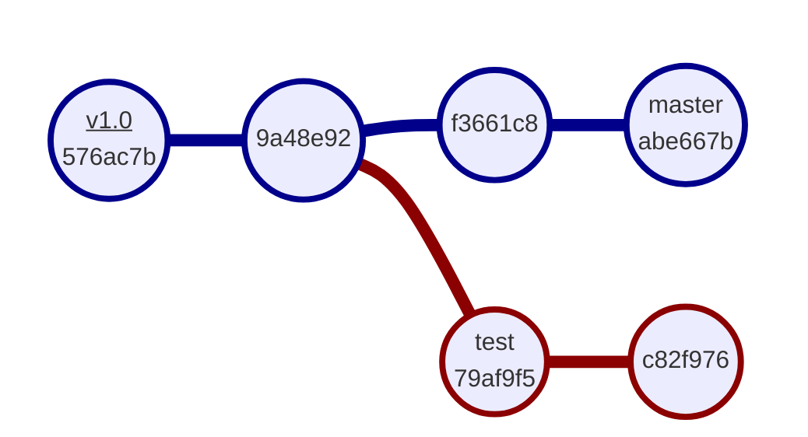
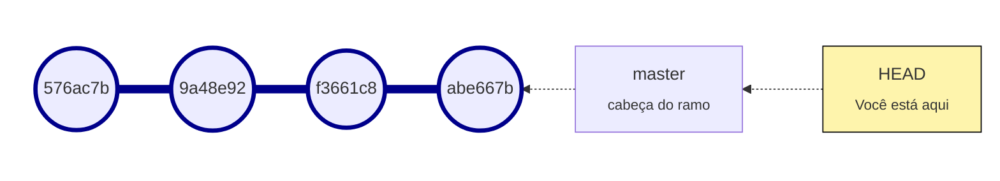
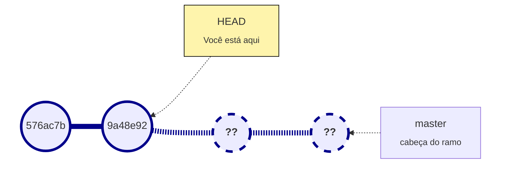
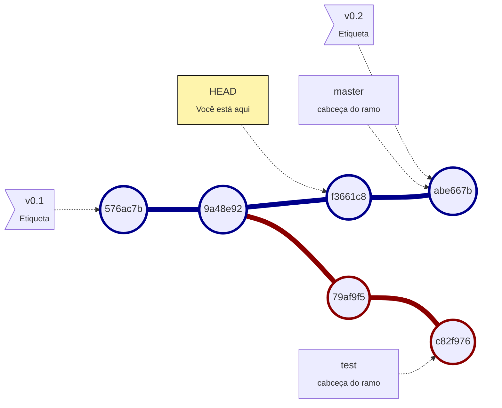
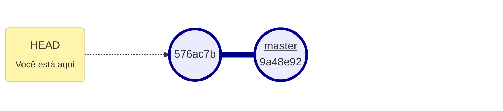
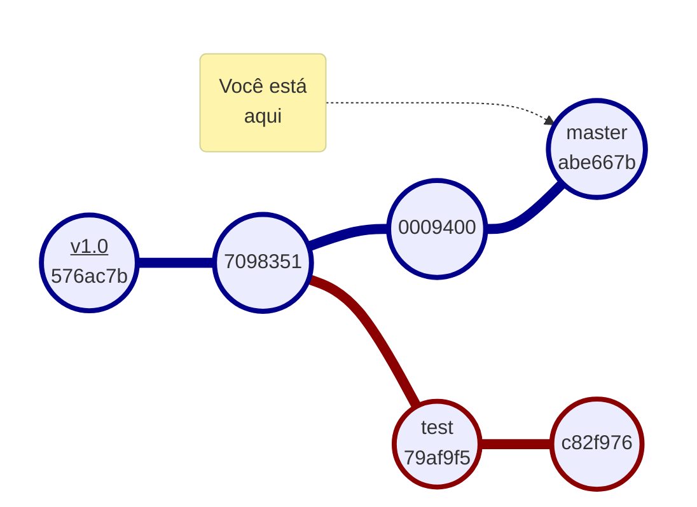
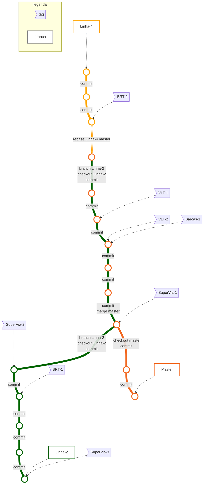

# Aula 5

## Termos utilizados:

* Checksum, hash - um código aleatório como este:
  
  ```git
  7f565c37e45effb008ef146b5661eb40e302e2d3
  ```
  
  ou este:
  
  ```git
  7f565c3
  ```

* Ramo, ramificação, branch - divisões da árvore Git.

## Tag (etiqueta)

Servem como atalhos para algum commit que você considere importante, um marco do seu projeto.

Normalmente é usado para marcar as novas versões de programas (exemplo: `v1.0`, `v1.1`)

> É possível adicionar mais de uma tag para o mesmo commit.

Há dois tipos de tags:

* **Tag leve**  - Um ponteiro para um commit, sem informações embutidas;

* **Tag anotada** - Um ponteiro para um commit que contém informações: nome , email, data, hash e uma mensagem de tag (opcional, mas recomendado). 

### Qual devo usar?

* **Tag leve**: Caso queira criar uma tag temporária ou simplesmente não quer guardar informações, apenas apontar.

* **Tag anotada**: Na dúvida, sempre crie tags anotadas, eles terão registros para você consultar depois.

### Listar tags:

```git
git tag
```

### Ver detalhes da tag:

:warning: Este comando abre o VIM, se usado fora do Git Bash.

```git
git show v1.0
```

Retorno:

```git
tag v1.0
Tagger: Raphael Rivas <raphaelrivas@hotmail.com>
Date:   Sun Apr 10 01:07:08 2022 -0300

primeira versao

commit 7f565c37e45effb008ef146b5661eb40e302e2d3 (tag: v1.0)
Author: Raphael Rivas <raphaelrivas@hotmail.com>
Date:   Sat Apr 9 02:26:27 2022 -0300

    teste del

diff --git a/teste.txt b/teste.txt
index 95d09f2..83063e3 100644
--- a/teste.txt
```

### Ver detalhes do commit apenas:

```git
git show 7f565c37e45effb008ef146b5661eb40e302e2d3 
```

### Criar tag leve:

> :warning: Não é encorajado usar tags leves, pois eles não contém informações

Por padrão as tags são criadas apontando para o commit mais recente.

```git
git tag v1.0
```

### Criar tag anotada:

```git
git tag -a v1.0 -m "versao 1.0"
```

### Criar tag em qualquer commit:

> Como boa prática, o exemplo criou uma tag anotada.

```git
git tag -a v0.0 -m "primeira versao" 7f565c37e45effb008ef146b5661eb40e302e2d3
```

Resumindo, o comando é: `git tag` + checksum do commit.

Tags no VSCode:


Tags no gitk:


> Note que é possível criar tags no Git GUI, apenas no gitk.

### Remover tag:

```git
git tag --delete "primeira versao"
```

## Trocar de commit usando tag:

## Ver detalhes do commit:

```git
git show 576ac7be6b79d4e260ac9be5291134e88761854f
```

## Árvore Git


A imagem acima é uma representação da árvore Git.

### Commit (confirmação)

```mermaid
flowchart LR
a((" "))---b((" "))---c((" "))

style a stroke:darkblue, stroke-width: 2px, fill:yellow
style b stroke:darkblue, stroke-width: 2px, fill:yellow
style c stroke:darkblue, stroke-width: 2px, fill:yellow
%%style c1 fill: transparent, stroke: black ,stroke-dasharray: 5 5, stroke-width: 
linkStyle 0,1 stroke:darkblue,stroke-width:4px;
```




Cada *bolinha* é um commit realizado no repositório.

Cada commit é um objeto Git que contém todas as alterações feitas naquele período, como uma verdadeira máquina do tempo.

Nesta árvore, por exemplo, contém dois ramos (branches):

* Azul - o ramo principal chamado `master`

* Vermelho - o ramo extra, foi chamado chamado de `test`

Por padrão, o primeiro branch criado no Git é nomeado `master`.

## Branch (ramo)



O branch é um ponteiro móvel para um commit.  
A cada novo commit ele avança automaticamente.

Você visualiza os ramos através de seus nomes (`master`, `test`, `outro-nome`, etc).  
Por padrão o primeiro branch será nomeado "`master`".

### HEAD (você)



HEAD é um ponteiro para o commit em que você está.

Por padrão o HEAD aponta para o ramo `master` (que aponta para o último commit de sua ramificação)

#### Mover HEAD para qualquer commit:

```git
git checkout 9a48e92
```

Resultado:



:inform Como regra geral, você nunca consegue visualizar commits a sua frente, apenas atrás de você.  
Por isso a imagem mostra duas icógnitas, estão a frente de você.

#### Mover para a cabeça do branch:

```git
git checkout HEAD
```

xxxx



* O repositório foi criado, sem commits, sem nada.

* Então criamos o readme.md, e confirmamos.

* Como resultado, nossa árvore Git é uma única bolinha, um único commit

* HEAD representa duas coisas:
  
  1. O commit em que você (usuário) está;
  
  2. A cabeça do seu ramo.

Editamos o readme e confirmamos as alterações:



* Perceba que você estava

## Navegando na árvore



### Mudar de commit:

```git
git checkout insira_hash_do_commit
git checkout 
```

### Mudar de commit via tag:

```git
git checkout  nome_da_tag
```

## Recuperar commits que "sumiram":

Visualizar últimos *hashes*:

```git
git reflog
```

Retornar ao commit anterior:

```git
git reset --hard <sha1>
```

### Curiosidades sobre árvore Git

O sistema de metrô do Rio de Janeiro parece uma árvore Git.  
Uma bem reta.


Veja como o metrô do Rio em forma de Git:




*Mapa resumido. Algumas estações e a linha 3 (cancelada) foram ocultados para fins didáticos.*

## Fontes:

* [Criando Tags - Git](https://git-scm.com/book/pt-br/v2/Fundamentos-de-Git-Criando-Tags)
* [What is HEAD in Git? - Stack Overflow](https://stackoverflow.com/questions/2304087/what-is-head-in-git)
* [Branches em poucas palavras - Git](https://git-scm.com/book/pt-br/v2/Branches-no-Git-Branches-em-poucas-palavras)

Tradução de termos em português:

* [Book - Git (espanhol)](https://git-scm.com/book/es/v2)

### Imagens:

Usado como base para o mapa metroviário de Rio e Niterói:

* [**Sobre o Metrô, Rio** - Rio Cidade Maravilhosa](http://www.riocidademaravilhosa.com.br/riodejaneiro/mobilidade/metro/)

* [**Metrô desfigurado - As recentes intervenções no modal estrangulam a capacidade do metrô** - Diário do Rio de Janeiro](https://diariodorio.com/metro-desfigurado/)
