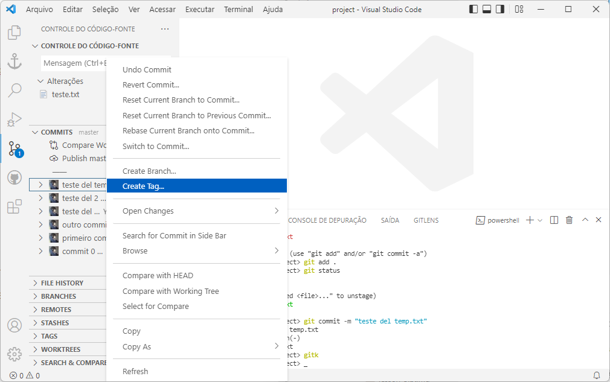
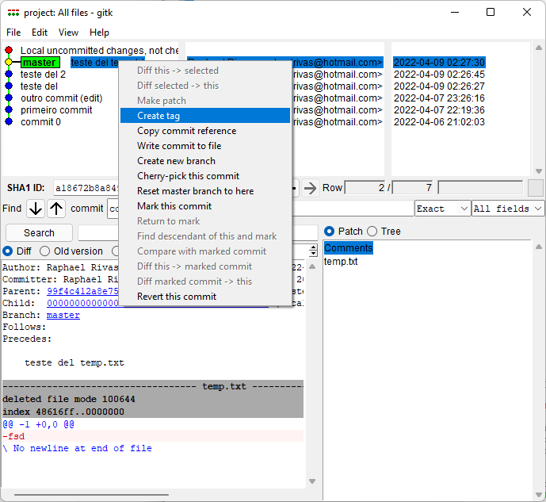
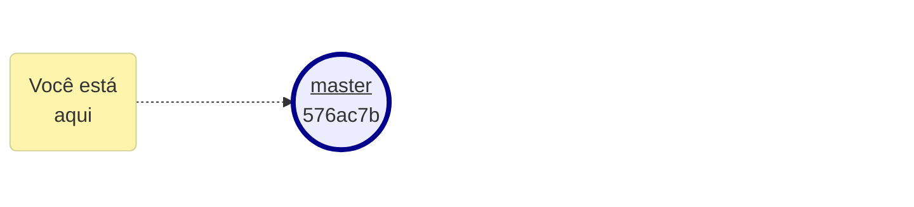
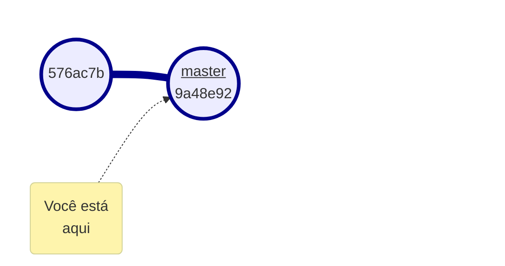
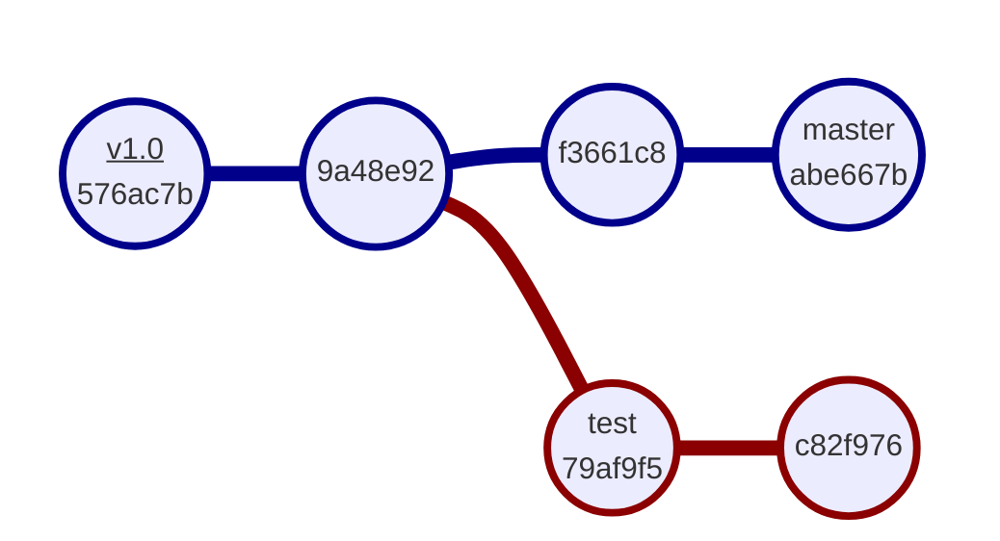
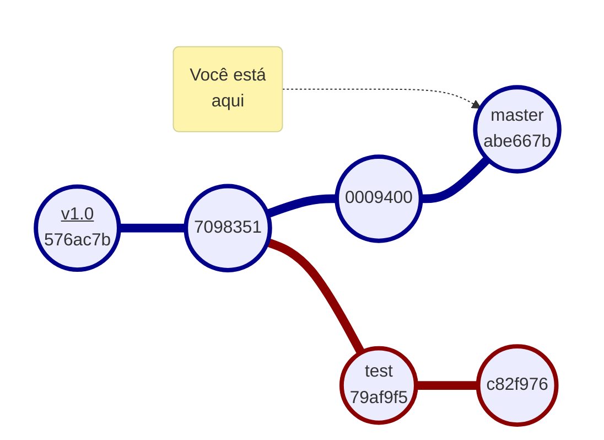
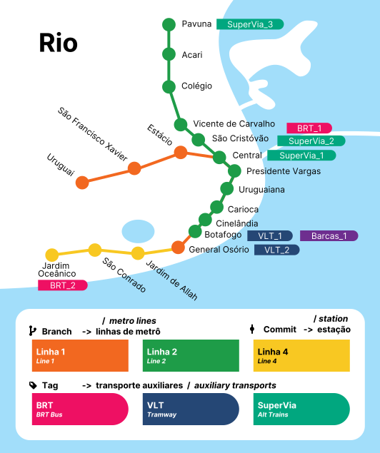

# Aula 5

## Termos utilizados:

* Checksum, hash - um código aleatório como este:
  
  ```git
  7f565c37e45effb008ef146b5661eb40e302e2d3
  ```
  
  ou este:
  
  ```git
  7f565c3
  ```

## Tag (etiqueta)

Servem como atalhos para algum commit que você considere importante, um marco do seu projeto.

Normalmente é usado para marcar as novas versões de programas (e.g. `v1.0`, `v1.1`)

Há dois tipos de tags:

* **Tag leve**  - um mero atalho que aponta para um commit específico;

* **Tag anotada** - além de ser um atalho para um commit, ele contém o nome , email, data, hash e uma mensagem de tag (opcional, mas recomendado). 

Qual devo usar?

* **Tag leve**: Caso queira criar uma tag temporária ou simplesmente não quer guardar informações, apenas apontar.

* **Tag anotada**: Na dúvida, sempre crie tags anotadas, eles terão registros para você consultar depois.

### Listar tags:

```git
git tag
```

### Ver detalhes da tag:

:warning: Este comando abre o VIM, se usado fora do Git Bash.

```git
git show v1.0
```

Retorno:

```git
tag v1.0
Tagger: Raphael Rivas <raphaelrivas@hotmail.com>
Date:   Sun Apr 10 01:07:08 2022 -0300

primeira versao

commit 7f565c37e45effb008ef146b5661eb40e302e2d3 (tag: v1.0)
Author: Raphael Rivas <raphaelrivas@hotmail.com>
Date:   Sat Apr 9 02:26:27 2022 -0300

    teste del

diff --git a/teste.txt b/teste.txt
index 95d09f2..83063e3 100644
--- a/teste.txt
```

> Caso queira ver apenas os detalhes do commit, use `git show` + checksum do commit

### Criar tag leve:

Por padrão as tags são criadas apontando para o commit mais recente.

```git
git tag v1.0
```

> :warning: Não é encorajado usar tags leves, pois eles não contém informações

### Criar tag anotada:

```git
git tag -a v1.0 -m "versao 1.0"
```

### Criar tag em qualquer commit:

Como boa prática, criou-se uma tag anotada.

```git
git tag -a v0.0 -m "primeira versao" 7f565c37e45effb008ef146b5661eb40e302e2d3
```

> Em outras palavras: `git tag` + checksum do commit.
> 
> A ordem dos parâmetros não faz diferença, mas nesta ordem parece organizado.

VSCode:



gitk:



> Não é possível criar tag no Git GUI, apenas no gitk.

### Remover tag:

```git
git tag --delete "primeira versao"
```

## Trocar de commit usando tag:

## Ver detalhes do commit:

```git
git show 576ac7be6b79d4e260ac9be5291134e88761854f
```

## Árvore Git


Cada bolinha é um commit.

Cada commit tem um hash único.

### Evolução de uma árvore Git

Imagine que criamos um repositório novo, adicionamos um arquivo `readme.md` e confirmamos no Git:

```git
git init
git add readme.md
git commit -m "primeiro commit"
```



Editamos o readme e confirmamos as alterações:



* Note que o 

## Branch (ramo)



Isto é uma árvore Git.

Cada bolinha é um commit, neles você pode ver seus checksums.

O primeiro commit da árvore foi marcado com a tag `v1.0`.

Nesta árvre temos dois ramos:

* Azul - o ramo principal `master`.

* Vermelho - o ramo extra (`test`) que foi criado para testes.

## Navegando na árvore

# 



### Mudar de commit:

```git
git checkout insira_hash_do_commit
git checkout 
```

### Mudar de commit via tag:

```git
git checkout  nome_da_tag
```

## Recuperar commits que "sumiram":

Visualizar últimos *hashes*:

```git
git reflog
```

Retornar ao commit anterior:

```git
git reset --hard <sha1>
```

### Curiosidades sobre árvore Git

O sistema de metrô do Rio de Janeiro parece uma árvore Git.  
Uma bem reta.


Veja como o metrô do Rio em forma de Git:




*Mapa resumido. Algumas estações e a linha 3 (cancelada) foram ocultados para fins didáticos.*


## Fontes:

* [Criando Tags - Git](https://git-scm.com/book/pt-br/v2/Fundamentos-de-Git-Criando-Tags)

### Imagens:

Usado como base para o mapa metroviário de Rio e Niterói:

* [**Sobre o Metrô, Rio** - Rio Cidade Maravilhosa](http://www.riocidademaravilhosa.com.br/riodejaneiro/mobilidade/metro/)

* [**Metrô desfigurado - As recentes intervenções no modal estrangulam a capacidade do metrô** - Diário do Rio de Janeiro](https://diariodorio.com/metro-desfigurado/)
