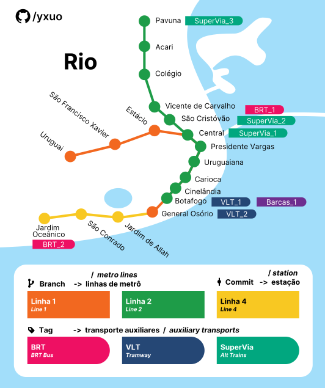

# Aula 5

## Todo

* [ ] consertar conflito commit

## Termos utilizados:

* Checksum, hash - um código aleatório como este:
  
  ```git
  7f565c37e45effb008ef146b5661eb40e302e2d3
  ```
  
  ou este:
  
  ```git
  7f565c3
  ```

* Ramo, ramificação, branch - divisões da árvore Git.

## Árvore Git


A imagem acima é uma representação da árvore Git.

Nesta árvore, por exemplo, contém dois ramos (branches):

* Azul - o ramo principal chamado `master`

* Vermelho - o ramo extra, foi chamado chamado de `test`

> Por padrão o primeiro branch criado é nomeado "`master`".

#### Visualizar árvore inteira:
:star: Todos os comandos do `git log` podem ser usados com branches, tags e commits.

Este comando sempre exibe a árvore inteira do repositório, independente de onde o HEAD esteja.

```git
git log --all 
```

#### Visualizar apenas um ramo específico:

```git
git log master
git log test
```


#### Visualizar apenas uma linha:

*Recaptulação.*

```git
git log --pretty=oneline
git log --oneline
```

#### Visualizar em forma de árvore

:star: Todos os parâmetros podem ser combinados.

```git
git log --graph
git log --graph --oneline
git log --graph --oneline --all
```

Exemplo de saída:

```git
* 605e3ff (test) test file
| * a18672b (master) teste del temp.txt
| * 99f4c41 teste del 2
| * 7f565c3 (tag: tague2, tag: tague1) teste del
|/
* 9bb1af9 (HEAD) outro commit (edit)
* 1a3009c primeiro commit
* 576ac7b commit 0
```

#### Visualizar HEAD (padrão)

Navegando no VIM (modo visualização):

* :arrow_up: `K` - Mover uma linha acima
* :arrow_down: `J` - Mover uma linha abaixo
* :arrow_double_up: `PgUp` - Mover várias linhas acima
* :arrow_double_down: `PgDn` - Mover várias linhas acima
* `q` - sair

## Commit (confirmação)


Cada *bolinha* da árvore é um commit do repositório.

O commit é um objeto Git que contém todas as alterações feitas naquele período, como uma verdadeira máquina do tempo.

Por padrão, o primeiro branch criado no Git é nomeado `master`.

### Ver detalhes do commit:

```git
git show 576ac7b
```

## HEAD (você)


HEAD é um ponteiro para o commit em que você está.

Por padrão o HEAD aponta para o ramo `master` (que aponta para o último commit deste ramo)

## Navegando pela árvore

### Navegar para qualquer commit:

```git
git checkout 9a48e92
```

Resultado:


Por padrão, o `git log` exibe commits a partir do HEAD (onde você está).  
Em outras palavras, `git log` é o mesmo que `git log HEAD`.

Note também que `git log` só exibe commits anteriores, nunca commits a frente.

> O máximo que daria para fazer, neste caso, é visualizar todos os commits do ramo ou da árvore inteira.
 
No VSCode é possível visualizar ramos, commits, tags, de diversas maneiras:


### Navegar para o commit anterior:

```git
git checkout HEAD~
git checkout HEAD~1
```

Resultado:


> Moveu-se um commit atrás do HEAD.

### Navegar vários commits atrás:

```git
git checkout HEAD~3
```

> Moveu-se três commits atrás do HEAD.

### Navegar para a cabeça do ramo:

```git
git checkout master
```

Resultado:


### Outras formas de navegar:
:star: Todos os comandos do `git checkout` podem ser usados no HEAD, em branches, commits e tags:

```git
git checkout master~3
git checkout f3661c8~3
git checkout v1.0~3
```

### Histórico de commits navegados:

```git
git reflog --pretty=newline
```

## Branch (ramo)


O ramo (branch) é um ponteiro móvel para um commit.  
A cada novo commit o ramo avança automaticamente.

Deste modo, todo ramo aponta para o commit mais atual, tornando possível executar um `git log master`, por exemplo.

Você visualiza os ramos através de seus nomes (`master`, `test`, `qualquer-nome`, etc).

### Criar novo ramo:

```git
git branch abcde
```

Criar e navegar no novo ramo:

```git
git checkout -b abcde
```

### Mesclar ramos:

Mesclar o ramo `test` dentro do ramo `master`:

```git
git checkout master
git merge test
```

Uma outra forma de ver:
```git
git checkout destino
git merge origem
```

> Mesmo que você já esteja no ramo `destino`, é sempre boa prática navegar antes de mesclar.
>
> Vai que você não está no local que pensava...

:star: `git checkout` pode mesclar o ramo em qualquer outro commit.

### Conflitos de mescla:

Quando acontece um erro, você receberá uma mensagem como esta:

```git
Auto-merging teste.txt
CONFLICT (content): Merge conflict in teste.txt
Automatic merge failed; fix conflicts and then commit the result.
```

> O aviso te disse em qual arquivo está o conflito.

Em geral conflitos ocorrem quando as mesmas linhas do mesmo arquivo possuem alterações diferentes.

Por exemplo:

Branch `test` (origem):

```
Hello world
Esta linha será assado!
Fim.
```

Branch `master` (destino):

```
Hello world
Esta linha será assim!
Fim.
```

O Git não tem como saber qual escolher. Você decide.

### Resolvendo conflitos de forma prática

1. Veja a diferença em cada arquivo:

```git
git diff
```

> :warning: No Git Bash do VSCode o VIM não suporta navegar com as setas :arrow_down: :arrow_up:, use `J` e `K`.
> 
> Para poder navegar com as setas no terminal do VSCode, use `git diff` dentro do Powershell ou Prompt.

Retorno:

```git
Hello world
<<<<<<< HEAD
Esta linha será assado!
=======
Esta linha será assim!
>>>>>>> master
Fim.
```

### Resolvendo conflitos manualmente

#### 1. Veja os arquivos em conflito:

```git
git status
```

Retorno:

```git
Unmerged paths:
  (use "git add <file>..." to mark resolution)
        both modified:   teste.txt
```

> Os arquivos onde diz `both modified` estão em conflito.

#### 2. Abra os arquivos em conflito:

`teste.txt`

```git
Hello world
<<<<<<< HEAD
Esta linha será assado!
=======
Esta linha será assim!
>>>>>>> master
Fim.
```

Como pode ver, o Git editou o arquivo `teste.txt`, colocou ambas escritas uma em cima da outra.

#### 3. Edite o documento e escolha o que manter:

Basta apagar o texto do git (`<<< HEAD`, `>>> master`, `===`) e você escolher como vai ficar.

Aceitar a mudança atual:

> *Accept Current Change*

```git
Hello world
Esta linha será assado!
Fim.
```

Manter alteração original:

> *Accept Incoming Change*

```git
Hello world
Esta linha será assim!
Fim.
```

Aceitar ambas alterações:

> *Accept Both Changes*

```git
Hello world
Esta linha será assado!
Esta linha será assim!
Fim.
```

Recusar tudo e editar do seu jeito:

```git
Hello world
Esta linha será assim e assado, e assim será!
Fim.
```

#### 4. Tente mesclar após as correções:

Erro `unmerged files`:


## Tag (etiqueta)

Servem como atalhos para algum commit que você considere importante, um marco do seu projeto.

Normalmente é usado para marcar as novas versões de programas (exemplo: `v1.0`, `v1.1`)

> É possível adicionar mais de uma tag para o mesmo commit.

Há dois tipos de tags:

* **Tag leve**  - Um ponteiro para um commit, sem informações embutidas;

* **Tag anotada** - Um ponteiro para um commit que contém informações: nome , email, data, hash e uma mensagem de tag (opcional, mas recomendado). 

### Qual devo usar?

* **Tag leve**: Caso queira criar uma tag temporária ou simplesmente não quer guardar informações, apenas apontar.

* **Tag anotada**: Na dúvida, sempre crie tags anotadas, eles terão registros para você consultar depois.

### Criando uma tag

Tags podem ser criadas em commits, HEADs e branches (que no fim apontam para um commit).

Várias tags podem apontar para um mesmo commit.

Por padrão as tags são criadas no commit onde você está atualmente (HEAD).  
Em outras palavras, `git tag v0.1` é o mesmo que `git tag v0.1 HEAD`

* `v0.1` é um exemplo de nome de tag

### Remover tag:

```git
git tag --delete v0.1
```

### Criar tag leve:

:warning: Não encorajado!

```git
git tag v1.0
```

### Criar tag anotada:

```git
git tag -a v1.0 -m "versao 1.0"
```

### Criar tag para um commit ou branch:

```git
git tag -a v0.0 -m "primeira versao" 7f565c3
git tag -a v0.0 -m "primeira versao" master
```

### Criando tags em outros programas:

VSCode:


Gitk:


> É possível criar tags apenas no gitk, não no Git GUI.


### Listar tags:

```git
git tag
```

### Ver detalhes da tag:

:warning: Este comando abre o VIM, se usado fora do Git Bash.

```git
git show v1.0
```

Retorno:

```git
tag v1.0
Tagger: Raphael Rivas <raphaelrivas@hotmail.com>
Date:   Sun Apr 10 01:07:08 2022 -0300

primeira versao

commit 7f565c37e45effb008ef146b5661eb40e302e2d3 (tag: v1.0)
Author: Raphael Rivas <raphaelrivas@hotmail.com>
Date:   Sat Apr 9 02:26:27 2022 -0300

    teste del

diff --git a/teste.txt b/teste.txt
index 95d09f2..83063e3 100644
--- a/teste.txt
```

### Navegar para uma etiqueta (tag):


```git
git checkout v0.1
```

Resultado:


## Curiosidades sobre árvore Git

O sistema de metrô do Rio de Janeiro parece uma árvore Git, pois trata-se de uma simples linha reta com uma ramificação.  


Veja como o metrô do Rio em forma de Git:




*Mapa resumido. Algumas estações e a linha 3 (cancelada) foram ocultados para fins didáticos.*

## Fontes:

* [Criando Tags - Git](https://git-scm.com/book/pt-br/v2/Fundamentos-de-Git-Criando-Tags)
* [What is HEAD in Git? - Stack Overflow](https://stackoverflow.com/questions/2304087/what-is-head-in-git)
* [Branches em poucas palavras - Git](https://git-scm.com/book/pt-br/v2/Branches-no-Git-Branches-em-poucas-palavras)

* [Resolve GitHub Merge Conflicts - YouTube](https://www.youtube.com/watch?v=mOJazBNrG-c&t=118s)

* [How to resolve merge conflicts in Git - GitKraken](https://www.gitkraken.com/learn/git/tutorials/how-to-resolve-merge-conflict-in-git)

* [What's the simplest way to list conflicted files in Git? - StackOverflow](https://stackoverflow.com/questions/3065650/whats-the-simplest-way-to-list-conflicted-files-in-git)

* [Git merge is not possible because I have unmerged files - StackOverflow](https://stackoverflow.com/questions/36086202/git-merge-is-not-possible-because-i-have-unmerged-files)

Tradução de termos em português:

* [Book - Git (espanhol)](https://git-scm.com/book/es/v2)

* [O básico de ramificação e mesclagem - Git](https://git-scm.com/book/pt-br/v2/Branches-no-Git-O-b%C3%A1sico-de-Ramifica%C3%A7%C3%A3o-Branch-e-Mesclagem-Merge)

### Imagens:

Usado como base para o mapa metroviário de Rio e Niterói:

* [**Sobre o Metrô, Rio** - Rio Cidade Maravilhosa](http://www.riocidademaravilhosa.com.br/riodejaneiro/mobilidade/metro/)

* [**Metrô desfigurado - As recentes intervenções no modal estrangulam a capacidade do metrô** - Diário do Rio de Janeiro](https://diariodorio.com/metro-desfigurado/)
