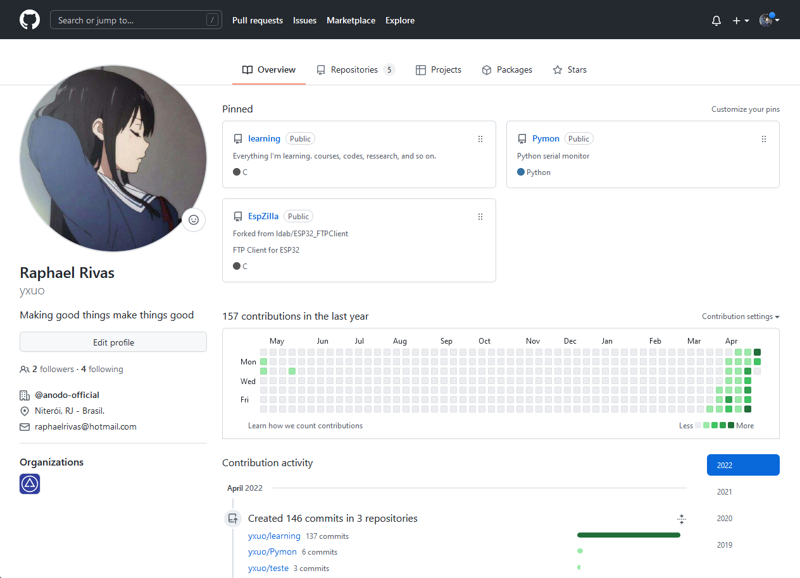
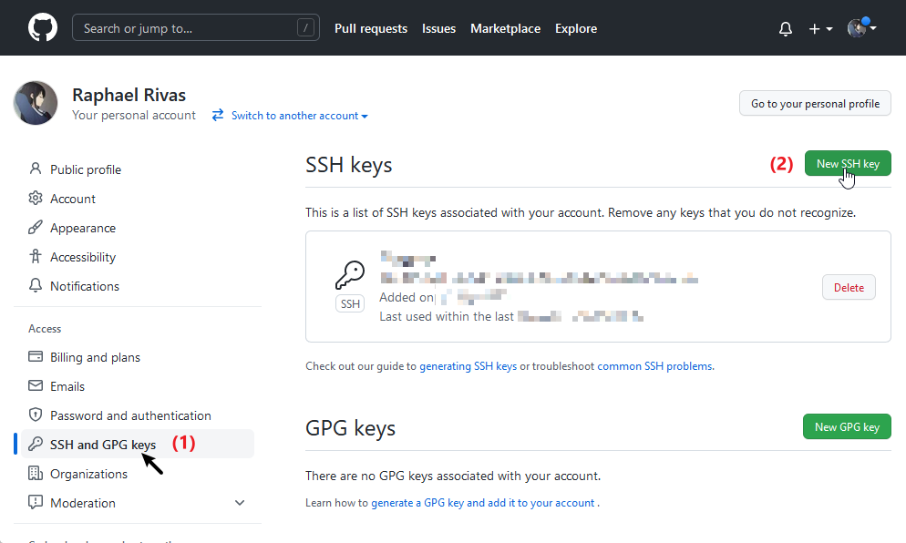
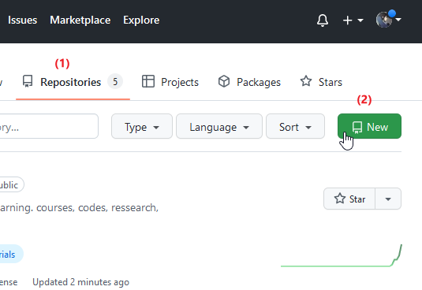
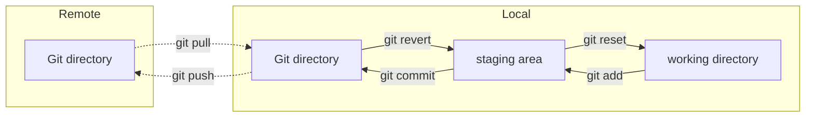

# Aula 6

**Tema: Git em servidores.**

Para fins didáticos, será usado uma máquina virtual Windows ao invés de um servidor Linux configurado (recomendado).

Afinal a proposta do curso é focar no básico do Git.

## GitHub

É um site feito para hospedar repositórios de forma prática.

Para poder usar, cadastre-se: https://github.com

### Página inicial

Ao entrar no GitHub, por padrão, sua tela inicial é uma "lsita de notícias" (news feed):

> Tela inicial do GitHub em 26/04/2022.


### Acessar seu perfil GitHub

O endereço do seu perfil é github.com/`nome-de-usuario`

Para acessar seu perfil dentro do site, clique no seu `ícone de usuário (🧑)` > `Seu perfil` (*Your profile*):


### Seu perfil github



> Este é o meu perfil :3

Seu perfil GitHub contém:

* Seus repositórios;

* Seu mapa de atividade: quantidade de commits você subiu para o GitHub a cada;

* Quais atividades e contribuições você fez no GitHub, que inclui:
  * Commits feitos no repositório.;
  * Repositórios criados;
  * Organizações (tipo perfis de empresa) que você entrou;
  * Pull requests, comentários, etc...
  * E no final da lista: quando você criou sua conta GitHub.

### Liberar acesso do seu PC ao seu GitHub

Para seu PC poder gerenciar seus repositórios no GitHub, é preciso:

1. Criar uma chave de acesso SSH no PC:

    Git Bash:

    ```git
    ssh-keygen
    ```

    Confirme o nome do arquivo:

    > Prefira não editar o nome de arquivo sugerido.

    * Aperte `Enter` para confirmar

    ```git
    Generating public/private rsa key pair.
    Enter file in which to save the key (/c/users/Rapha/.ssh/id_rsa)
    ```

    Defina a senha para acessar a chave SSH:

    > Prefira não usar senha!
    > 
    > Toda vez que sincronizar terá que digitar esta senha.
    >
    > Senhas em chaves SSH apenas valem a pena em ambientes que precisam de muita segurança.

    * Aperte `Enter` para não criar senha.

    :warning: Execute este comando sempre dentro do Git Bash, nunca no Powershell ou Prompt. Caso contrário a chave estará mal configurada e não será reconhecida corretamente.

2. Adicionar a chave na lista de chaves SSH do seu GitHub:

    Vá em `settings` > `SSH and PGP keys`

    

    

    

    Exemplo de chave ssh:
    ```git
    ssh-rsa AAAAB3NzaC1yc2EAAAABIwAAAQEAklOUpkDHrfHY17SbrmTIpNLTGK9Tjom/BWDSU
    GPl+nafzlHDTYW7hdI4yZ5ew18JH4JW9jbhUFrviQzM7xlELEVf4h9lFX5QVkbPppSwg0cda3
    Pbv7kOdJ/MTyBlWXFCR+HAo3FXRitBqxiX1nKhXpHAZsMciLq8V6RjsNAQwdsdMFvSlVK/7XA
    t3FaoJoAsncM1Q9x5+3V0Ww68/eIFmb1zuUFljQJKprrX88XypNDvjYNby6vw/Pb0rwert/En
    mZ+AW4OZPnTPI89ZPmVMLuayrD2cE86Z/il8b+gw3r3+1nKatmIkjn2so1d01QraTlMqVSsbx
    NrRFi9wrf+M7Q== schacon@mylaptop.local
    ```

### Criar repositório:



### Clonar repositório:

Copie o endereço SSH do GitHub:


Baixe o repositório usando este endereço:

```git
git clone git@github.com:yxuo/learning.git
```

Resultado:

Se você estava numa pasta chamada `projetos`, ele criou, dentro, uma pasta chamda `learning`.

Antes:

> * 📂 Projetos

Depois:

> * 📂 Projetos
>   * 📂 **Learning**
>     * 📂 .git
>     * readme.md

Sua pasta de projeto no PC será "Learning".

### Clonar repositório sem criar pasta:

```git
git clone git@github.com:yxuo/learning.git .
```

Em outras palavras:

```git
git clone _endereço_ .
```

Onde o ponto `.` representa a pasta onde você está.

Antes:

> * 📂 Projetos

Depois:

> * 📂 **Projetos**
>   * 📂 .git
>   * readme.md

Sua pasta de projeto no PC será "Projetos".

## Recaptulando gráfico de comandos Git:



## Fonte:

* [How to use ssh-keygen to generate a new SSH key - SSH](https://www.ssh.com/academy/ssh/keygen)