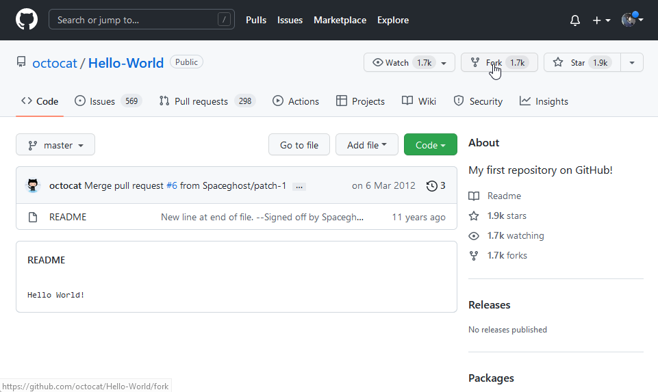
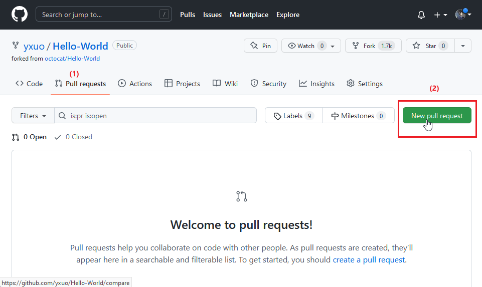
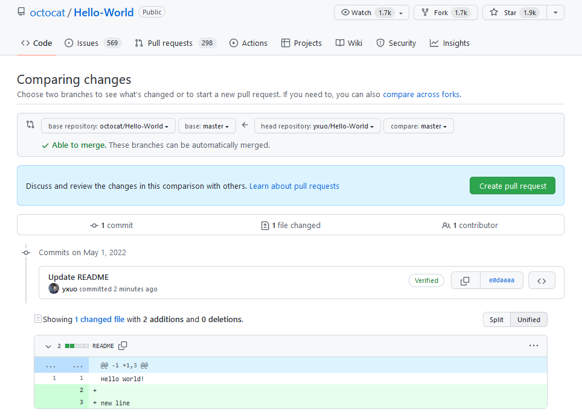

# Aula 8

*Como colaborar com projetos no GitHub.*

Todos os projetos públicos no GitHub são colaboráveis.

## Clonar projeto do GitHub

Vá na página do projeto e clique em `Fork`:

## Criando pull request

Abra seu fork, vá em pull requests e crie um novo:

Feito isso, edite os arquivos a sugerir alterações e envie:

