*Read this in other languages: [English](lesson-1.md), [português](lang/pt/lesson-1.pt.md)*

# Lesson 1

This lesson talks about what Git is and the basics of how does it works.

## Git is a version control system

Git is a **version control system** developed by Linus Torvalds.

A version control is a system that manages one or more files so that you can save and undo changes whenever you want.

Another advantage of this system is that several people can work at same time, because each user have their local version, while the official version is intact in the main repository.

How version control system works:


## Why use Git?

The advantage of Git over other version control systems is that  **Git is a distributed system**, decentralized. The other systems usually are (more) centralized, with another focus.

Conventional VCS vs Git:

```mermaid
flowchart TD
    subgraph GIT
          subgraph R1["Remote repository 🖥️☁️"]
            r1_v1(Version 1)
            r1_v2(Version 2)
            r1_vN(Version N)
            r1_v1 --- r1_v2
            r1_v2 -.- r1_vN
        end
        subgraph C1 ["Local repository 1 💻🔁"]
            c1_vT(Working version)
            c1_v1(Version 1)
            c1_v2(Version 2)
            c1_vN(Version N)
            c1_v1 --- c1_v2
            c1_v2 -.- c1_vN
        end
        subgraph C2 ["Local repository 2 💻🔁"]
            c2_vT(Working version)
            c2_v1(Version 1)
            c2_v2(Version 2)
            c2_vN(Version N)
            c2_v1 --- c2_v2
            c2_v2 -.- c2_vN
        end
        C1  --> R1
        C2 --> R1
    end

    subgraph SCV [SCV Convencional]
        subgraph S_R1["Repository 🖥️☁️"]
            S_r1_v1(Version 1)
            S_r1_v2(Version 2)
            S_r1_vN(Version N)
            S_r1_v1 --- S_r1_v2
            S_r1_v2 -.- S_r1_vN
        end
        subgraph S_C1 ["Local copy 1 💻🔁"]
            S_c1_vT(Working version)
        end
        subgraph S_C2 ["Local copy 2 💻🔁"]
            S_c2_vT(Working version)
        end
        S_C1 --> S_R1
        S_C2 --> S_R1
    end

    SCV --- GIT
    linkStyle 12 fill:none, stroke:none;
    style GIT fill:transparent, stroke-dasharray: 5 5, stroke:grey
    style SCV fill:transparent, stroke-dasharray: 5 5, stroke:grey
```



In Git you download all the contents of the repository on your PC, so you don't to access the internet every time to see all the files.

Git is distributed because every change you send to the repository can be downloaded by other machines, sharing the versions with everyone.

## How to use Git

In Git you have 3 steps for your files:

1. **Working directory:**
   
   * Contains the local files, you can edit as you wish because it will not change the repository.

2. **Staging area:**
   
   * When you want to send the files to the repository, you first mark files you want for sending. Exemple: `git add test.txt`.

3. **Git directory:**
   
   * It is a folder called `.git`, which is present in every project.
   * It contains all Git settings.
   * When you're ready, you can commit the changes to your local repository.
   * After that it is possible to apply the changes in the remote repository.
   
   > Git directory is also called:
   > 
   > Repositório Git é também chamado de:
   > 
   > * Git repository;
   > 
   > * Git folder;
   > - Git internal database;
   > 
   > - Git object database (file records, its addresses, keys, etc).
   > 
   > Thus, if you find these names strange, know that it's the same thing.

Git file stages:


## Installing Git

There are several ways to install:

### Via GitHub

If you are going to use GitHub or [GitLab](https://about.gitlab.com/) and you like convenience, simply download the `GitHub desktop` or `GitHub cli`, they download the latest version of Git automatically.

* GitHub Desktop: https://desktop.github.com/
  
  * Winget (Windows):
    
    ```powershell
    winget install github-desktop
    ```

* GitHub Cli: https://cli.github.com/
  
  * Winget (Windows):
    
    ```powershell
    winget install github-cli
    ```

### From the source

* Official site: https://git-scm.com/

* Winget (Windows):
  
  ```powershell
  winget install git -e
  ```

* PopOS, Ubuntu, Debian, and derivatives:
  
  ```bash
  sudo apt install git
  ```

## Initial settings

### Defina seu nome de usuário e email

Este será seu nome público em cada nova alteração feita em repositórios.

Após instalar o Git, ele tentará usar o nome de usuário genérico, talvez ele use o nome de usuário do seu SO e um email modelo (`username@git.com` ou algo assim).

Para definir seu nome:

```git
git config --global user.name "Meu Nome"
```

Para definir seu email:

```git
git config --global user.email "usuario@email.com"
```

> Susbtitua "meu nome" e "usuario@email.com" por seus usuário e email desejados.

### Para ver as configurações atuais do Git

```git
git config --list
```

Ele vai exibir o texto das configurações num editor de texto chamado VIM
Use as setas ⬆️ ⬇️ para navegar. Para sair digite `:q` e confirme com `ENTER` :leftwards_arrow_w

## Fontes

- [Recording Changes to the Repository - Git](https://git-scm.com/book/en/v2/Git-Basics-Recording-Changes-to-the-Repository)
- [Qual a diferença entre repositório, diretório e pasta? - Alura](https://cursos.alura.com.br/forum/topico-qual-a-diferenca-entre-repositorio-diretorio-e-pasta-117341)
- [What is the difference between working directory and repository - Medium](https://medium.com/tech-journey-with-anna/git-question-what-is-the-difference-between-the-working-directory-aka-workspace-and-the-eeee15b7e4b3)
