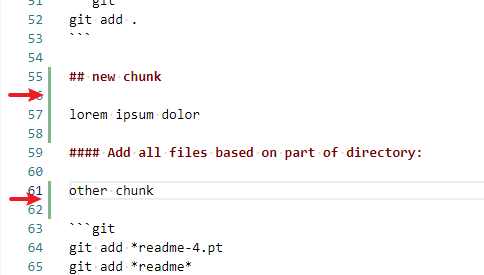
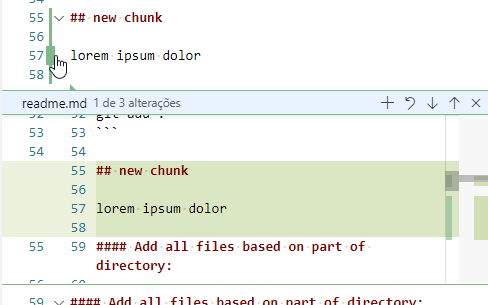
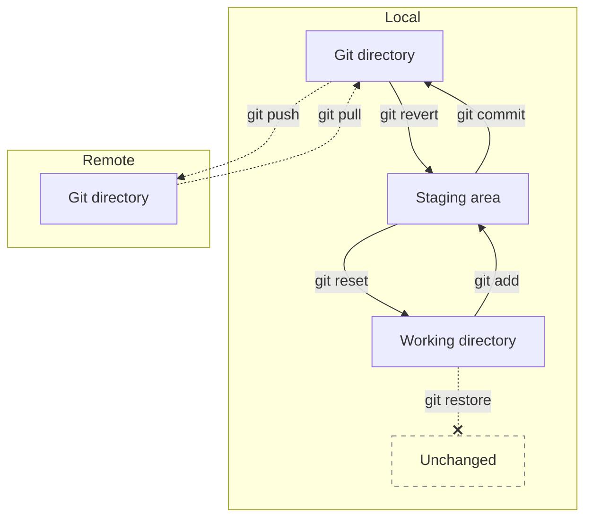

*Read this in other languages: [English](readme.md), [português](readme.pt.md)*

# Git

## Naming folders and files

So far this moment I haven't found anything about an official naming convention from either Git or GitHub.

Therefore, I'm based on my experience, opinions and recommendations of the community.

### Restrictions

Any system have boundaries, this will be the topic here.

* Some systems are case sensitive `Folder` and `folder` cohexist), some systems aren't.

  If your porject are made for web, Linux, and an Windows user can participate, avoid duplicate names.

### Recommendations

* Prefer to name in lowercase, to avoid confusion.  
  Use uppercase only when it really make sense.
    > Some systems are case sensitive, some aren't.
    >
    > We waste time deciding how to name each file.
    >
    > Mixed upper and lowercase folders are less eye friendly.

* Strongly prefer to use dash instead of space.

  > Webpages, some compilers and systems have problems to deal with folders with spaces.
  >
  > In webpages, spaces are represented as `%20`, which is not friendly at all. Use dash `-` instead.

### Naming folders:

Firstly, be aware that you can name all folders the any way you want, if that is your concern.

> Obviously some system folders like `.git` can't be even renamed.

## Git commands:

Note that "add" and "stage" are synonymous.

### Add file:

```git
git add readme.md
```

#### Add all:

```git
git add .
```

#### Add all files based on part of directory:

```git
git add *readme-4.pt
git add *readme*
```

> Be vigilant for which files have been added.

#### Stage lines of file:

```git
git add -e
```

VIM text editor (default) shall appear:

```git
first line
- old line
+ new line
```

Useful VIM commands:

* `i` &nbsp; &nbsp; &nbsp; &nbsp; &nbsp; &nbsp; &nbsp; &nbsp; &nbsp; &nbsp;insert mode
* `v`  &nbsp; &nbsp; &nbsp; &nbsp; &nbsp; &nbsp; &nbsp; &nbsp; &nbsp; selection mode
* `Esq` &nbsp; &nbsp; &nbsp; &nbsp; &nbsp; &nbsp; &nbsp; &nbsp;exit
* `dd` &nbsp; &nbsp; &nbsp; &nbsp; &nbsp; &nbsp; &nbsp; &nbsp; &nbsp;delete line
* `:wq` &nbsp; &nbsp; &nbsp; &nbsp; &nbsp; &nbsp; &nbsp; &nbsp;save and quit
* `:cq` &nbsp; &nbsp; &nbsp; &nbsp; &nbsp; &nbsp; &nbsp; &nbsp;cancel and quit
* `h`, `j`, `k`, `l` &nbsp; :arrow_left:, :arrow_down:, :arrow_up: :arrow_right:

### Stage chunks of lines:

```git
git add -p
```

Options:

* `y` - stage this chunk
* `n` - ignore this hunk
* `q` - quit
* `a` - stage this chunk and all later ones
* `d` - ignore this and the later ones
* `s` - split the current hunk into smaller hunks
* `e` - manually edit the current hunk: `git add -e`

Just like in VSCode:





### See staged lines of files:

```git
git diff --staged
```

### Commit:

```git
git commit readme.md -m "second line"
```

### Stage and commit:

```git
git commit readme.md -m "commit message"
```

## See status, and files to stage:

```git
git status
```

Sometimes, most of new files will be hidden under a folder:

```git
Your branch is ahead of 'origin/master' by 5 commits.
  (use "git push" to publish your local commits)

Untracked files:
  (use "git add <file>..." to include in what will be committed)
        python/trainings/
```

### See status of all new files

```git
git status -u
```

return:

```git
Untracked files:
Your branch is ahead of 'origin/master' by 5 commits.
  (use "git push" to publish your local commits)

  (use "git add <file>..." to include in what will be committed)
        python/trainings/logic/gabarito.py
        python/trainings/logic/readme.md
        python/trainings/logic/treino-1.py
```

## Branch:

### Commit branch

To send as independent branches:

```git
git commit master
```

```git
git commit feature
```

### Merge

To unite two branches into one of them:

```git
git checkout master
git merge feature
```

### Rebase

* To recreate a branch based in another branch/commit;

* To recreate, based on the last version of your project.

```git
git checkout feature
git rebase master
```

## Fast tips

### Main Git commands:



# Source

* [How to write a good commit message - freeCodeCamp](https://www.freecodecamp.org/news/a-beginners-guide-to-git-how-to-write-a-good-commit-message/)

* [How often should I/do you make commits? - StackExchange](https://softwareengineering.stackexchange.com/questions/74764/how-often-should-i-do-you-make-commits)

* [How to change a Git commit message - Linuxize](https://linuxize.com/post/change-git-commit-message/)

* [Git add specific lines not interactively - StackOverflow](https://stackoverflow.com/questions/50627024/git-add-specific-lines-not-interactively)

* [Add Specific Lines With Git Patch. Codementor](https://www.codementor.io/@maksimivanov/add-specific-lines-with-git-patch-eais7k69j)

Naming conventions:

* [Is there a naming convention for git repositories? - StackOverflow](https://stackoverflow.com/questions/11947587/is-there-a-naming-convention-for-git-repositories)

* [Devising a Git repository  naming convention - GravityDepth](https://gravitydept.com/blog/devising-a-git-repository-naming-convention)

  * [Web file and folder naming - CSUDH](https://www.csudh.edu/web-services/web-standards/file-folder-naming/)

* [Is it a good habit to write TODO to commit message? - StackOverflow](https://stackoverflow.com/questions/51260140/is-it-a-good-habit-to-write-todo-to-commit-message)