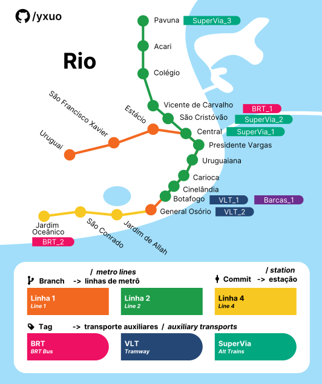
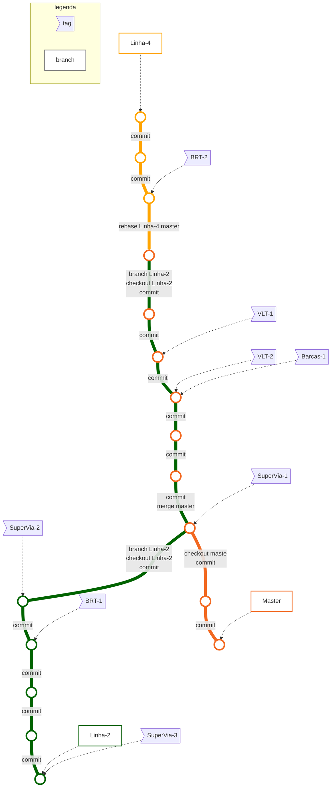

<!-- 
TODO: traduzir conteúdo do readme inglês
 -->

## Uma analogia sobre árvore Git

O sistema de metrô do Rio de Janeiro parece uma árvore Git, pois trata-se de uma simples linha reta com uma ramificação.  

Veja como o metrô do Rio em forma de Git:

*Mapa resumido. Algumas estações e a linha 3 (cancelada) foram ocultados para fins didáticos.*
