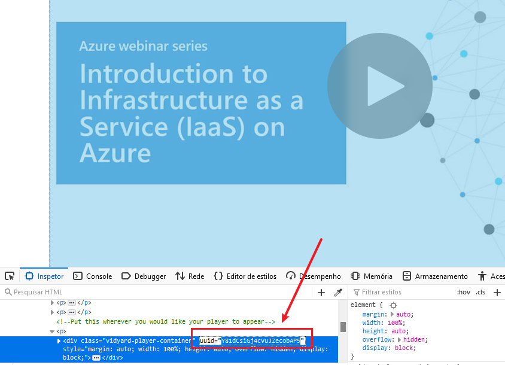

# Video online thumbnails

## YouTube

### 1280x720

```
https://img.youtube.com/vi/UUID/maxresdefault.jpg
```

### 640x480

```
https://img.youtube.com/vi/UUID/sddefault.jpg
```

### 480x360

```
https://img.youtube.com/vi/UUID/hqdefault.jpg
```

### 320x180

```
https://img.youtube.com/vi/UUID/mqdefault.jpg
```

## VidYard

```
https://play.vidyard.com/UUID.jpg 
```

Example:

```
https://play.vidyard.com/Y81dCsiGj4cVuJZecobAP5.jpg 
```


### Getting the uuid



## Source

* [How to download your video's thumbnail - VidYard](https://knowledge.vidyard.com/hc/en-us/articles/360009869594-How-to-download-your-video-s-thumbnail)