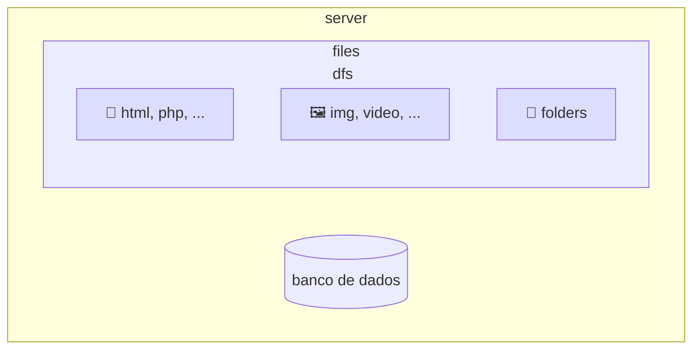
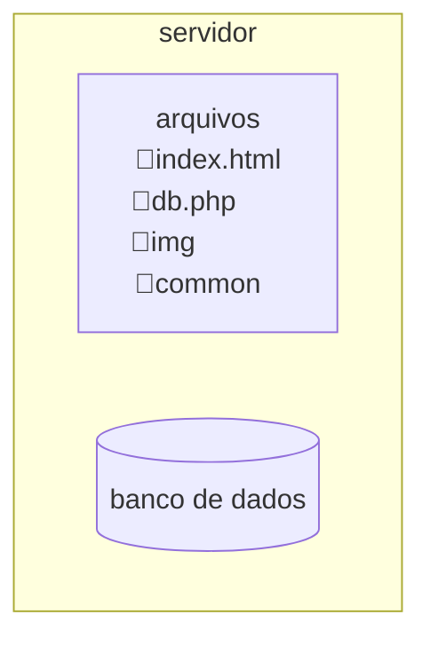
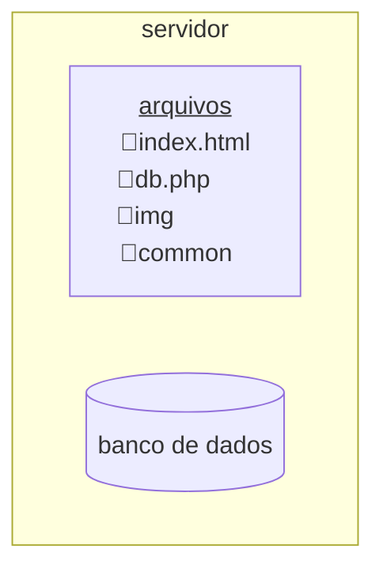
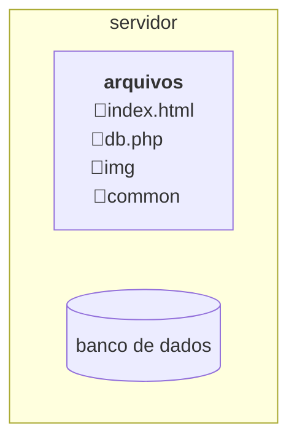
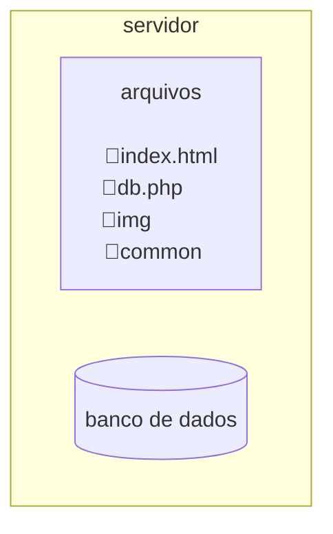

# Files

## By type

```mermaid
flowchart TD
subgraph Sservidor["server"]
    subgraph Sarq["files<br>dfs"]
        conf["📄 html, php, ..."]
        img["🖼️ img, video, ..."]
        folder["📁 folders"]
    end

    db[("banco de dados")]

    style Sarq fill:#ececff, stroke:mediumPurple
    style conf fill:#ddddff
    style img fill:#ddddff
    style folder fill:#ddddff
end
```

## Simple

```mermaid
flowchart TD
subgraph Sservidor["servidor"]

    arq["arquivos</b!><br>📄index.html<br>📄db.php ⠀⠀<br>📁img ⠀⠀⠀⠀<br>📁common⠀"]

    db[("banco de dados")]
end
```

## Underline

```mermaid
flowchart TD
subgraph Sservidor["servidor"]

    arq["<u>arquivos</u></b!><br>📄index.html<br>📄db.php ⠀⠀<br>📁img ⠀⠀⠀⠀<br>📁common⠀"]

    db[("banco de dados")]
end
```

## Bold

```mermaid
flowchart TD
subgraph Sservidor["servidor"]

    arq["<b>arquivos</b></b!><br>📄index.html<br>📄db.php ⠀⠀<br>📁img ⠀⠀⠀⠀<br>📁common⠀"]

    db[("banco de dados")]
end
```

## Spaced

```mermaid
flowchart TD
subgraph Sservidor["servidor"]

    arq["arquivos<br><br>📄index.html<br>📄db.php ⠀⠀<br>📁img ⠀⠀⠀⠀<br>📁common⠀"]

    db[("banco de dados")]
end
```
