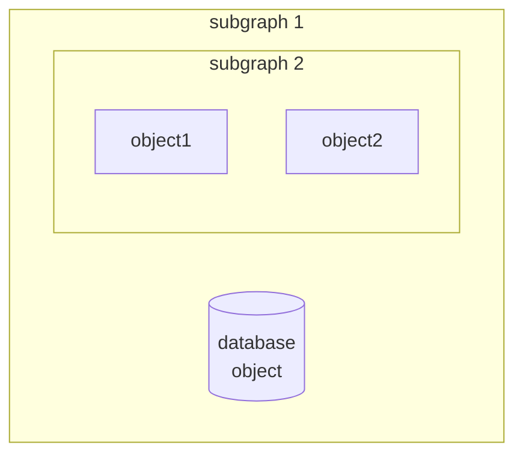
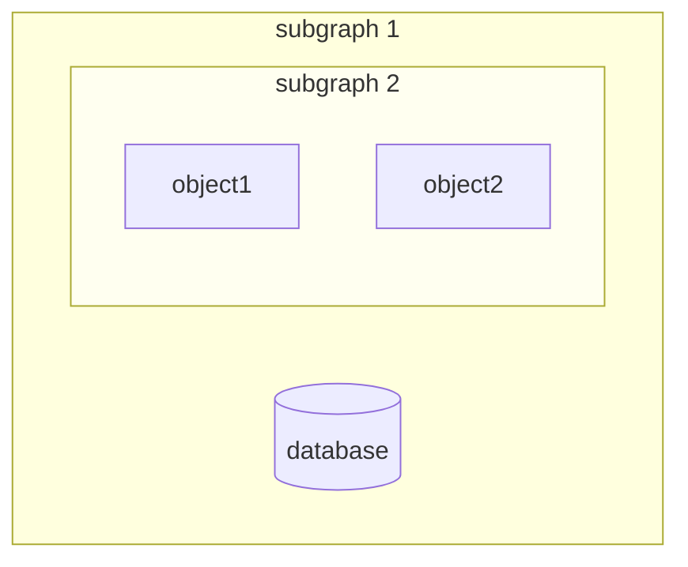
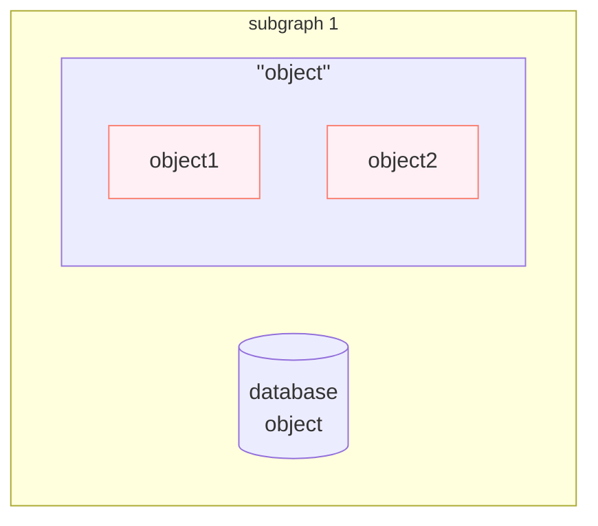
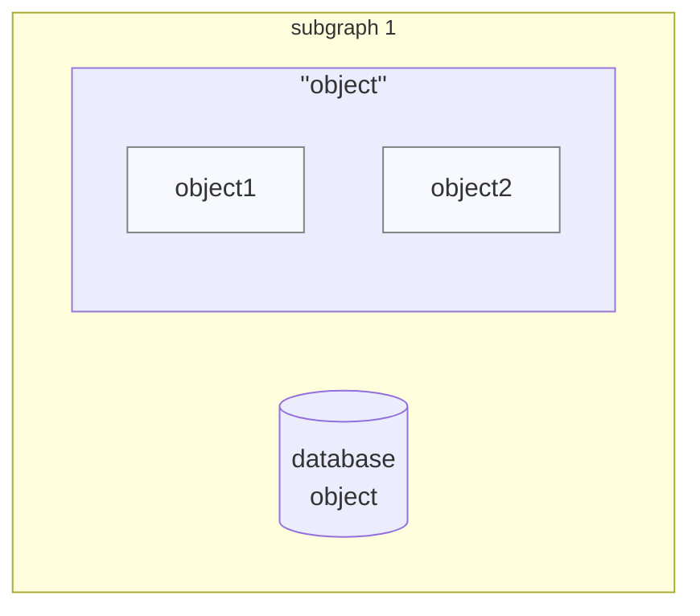
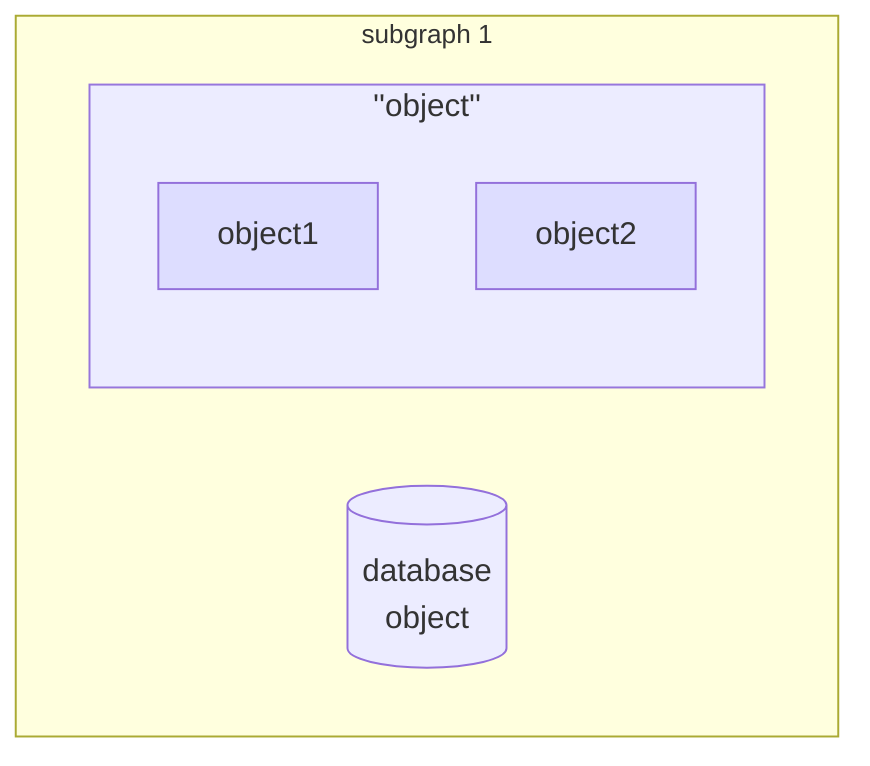

## Default

```mermaid
flowchart TD
subgraph Sservidor[subgraph 1]
    subgraph Sarq[subgraph 2]
        object1
        object2
    end
    db[("database<br>object")]
end
```

## Subgraph in 2 levels

```mermaid
flowchart TD
subgraph Sservidor[subgraph 1]
    subgraph Sarq[subgraph 2]
        object1
        object2
    end
    db[(database)]

    style Sarq fill:ivory, stroke:dark-khaki
end
```

## Subgraph as object

### Salmon

```mermaid
flowchart TD
subgraph Sservidor["<sup>subgraph 1</sup>"]
    subgraph Sarq["⠀''object''⠀"]
        object1
        object2
        style object1 fill: lavenderBlush, stroke: salmon
        style object2 fill: lavenderBlush, stroke: salmon
    end
    db[(database<br>object)]

    style Sarq fill:#ececff, stroke:#9776dc
end
```

### Mono

```mermaid
flowchart TD
subgraph Sservidor["<sup>subgraph 1</sup>"]
    subgraph Sarq["⠀''object''⠀"]
        object1
        object2
        %% style object1 fill: lavenderBlush, stroke: salmon
        style object1 fill: ghostWhite, stroke: gray
        style object2 fill: ghostWhite, stroke: gray
    end
    db[(database<br>object)]

    style Sarq fill:#ececff, stroke:#9776dc
end
```

### Gradient

```mermaid
flowchart TD
subgraph Sservidor["<sup>subgraph 1</sup>"]
    subgraph Sarq["⠀''object''⠀"]
        object1
        object2
        %% style object1 fill: lavenderBlush, stroke: salmon
        style object1 fill: #DDDDFF, stroke: mediumpurple
        style object2 fill: #DDDDFF, stroke: mediumpurple
    end
    db[(database<br>object)]

    style Sarq fill:#ececff, stroke:#9776dc
end
```