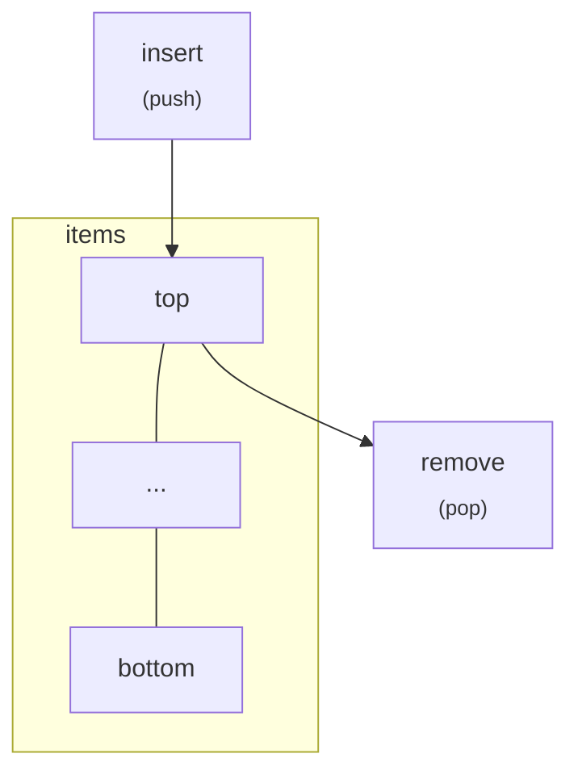
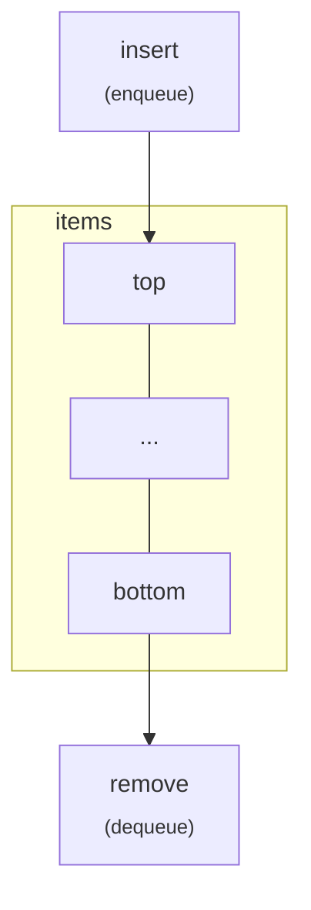

# Programming

## General topics

* Flag - Variable used as a temporary item, like buffer, number counter, iteration parser.

    Example in c:

    ```c
    for (int i = 0; i < 10; i++)
    ```

## Data structures

### Array

* Lower level;
* Stores single data type;
* Fixed size;
* Static, use index operator;

### Vector

* High level;
* Can store multiple data types;
* The size can vary;
* Dynamic, uses structures.

## Sorting structures

### Stack

LIFO - last in, first out


### Queue

FIFO - first in, first out



<!-- TODO: graph -->
<!-- TODO: list -->
### Tree

* Node: each element of the tree.
* Root: the initial node, on the start of the tree.
* Degree: the number of children that a node have.
* Distance: the number of edges of the shortest path between two nodes. You can count nodes starting by zero.
* Level/Depth: the distance between a node and the root.
  * For example, given a tree `A-B-C`, where A is the root, the distance between A and C is 
* Height: the biggest level in the tree.
* Width: the number of nodes in a level.
* Size: the total number of nodes in the tree.
* Leaf: a node without children.

#### Tree structure
* Search binary tree:
  * It have up to two children
  * Ideally, the nodes on the left have lower values than a given node. The nodes on the right have higher values.
* Balanced tree:
  * All sub trees on each level have its height with at most one unit of difference.
  * 
* List:
  * A list can be considered a tree where all nodes have at most one children.

<!-- TODO: Sorting algorithms -->

### Source

* [Definition on C++ vector vs list - Educba](https://www.educba.com/c-plus-plus-vector-vs-list/)
* [Lists vs array in Python - Medium](https://medium.com/backticks-tildes/list-vs-array-python-data-type-40ac4f294551)

<!--
TODO: Graph, Adjacent list - https://www.geeksforgeeks.org/comparison-between-adjacency-list-and-adjacency-matrix-representation-of-graph/
 -->