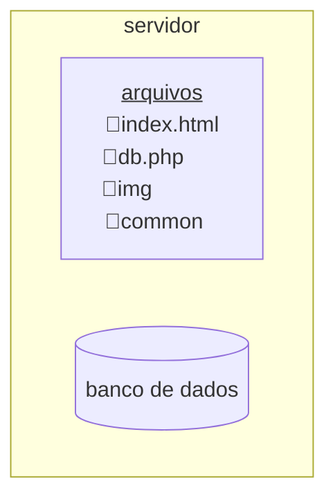
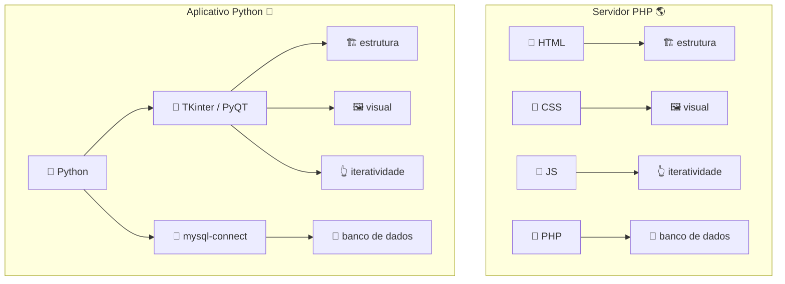
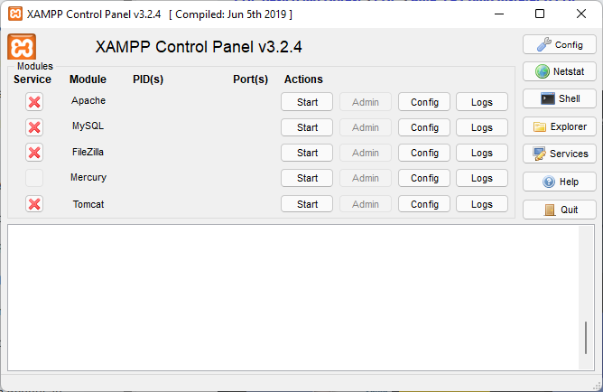
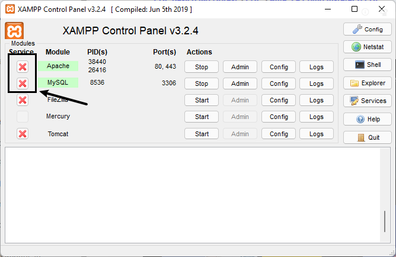
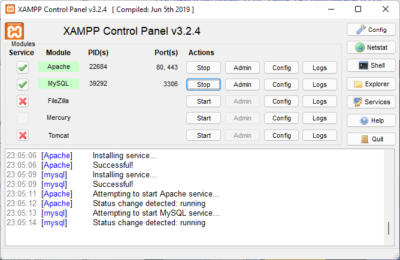

# Banco de dados com Python

Como administrar, fazer query de SQL usando apenas Python, ao invés de PHP, HTML ou CSS.

## Como funciona um banco de dados

Você usará um servidor:



Um servidor é um computador, que irá rodar seu site.  
Ele contém seus arquivos normais e uma pasta apenas com os arquivos de banco de dados.

Para rodar seu site é possível usar um servidor remoto (hospedagem) ou local (seu pc).

Um servidor local é útil para testar sites sem precisar usar hospedagem e pagar mensalidade.

## Site PHP vs aplicativo Python



## Montando um servidor local

O código será testado num servidor local.  
O método mais fácil de rodar um servidor local, no Windows, é instalando o XAMPP.

## XAMPP

XAMPP é um programa que instala e roda um servidor completo em poucos cliques.  
Ele contém:

* **Apache** - servidor HTTP
* **MySQL** - banco de dados
* Filezilla - suporte a FTP (baixar e subir arquivos)
* Mercury - servidor de email
* Tomcat - contêiner para criar apps java

### Instalação

Terminal:

```powershell
winget install xampp
```

Site: [ApacheFriends](https://www.apachefriends.org/pt_br/index.html)

### Configuração inicial

Ao instalar, inicie o XAMPP. Você deve visualizar uma janela como esta:



Clique no botão `❌` para instalar Apache e MySQL:



Se o Apache e MySQL mostrarem botões `✔️` então está tudo instalado e pronto:



### Inicializar o XAMPP

Em Apache e MySQL, clique em `Start`.

## Usando Python com MySQL

Primeiro é preciso instalar python direto no seu PC.

### Instalando Python:

Terminal:

  ```powershell
  winget install Python.Python.3
  ```

Site: [Python](https://www.python.org/downloads/)

#### Verifique se foi instalado com sucesso:

Python:

```powershell
python --version
```

Pip:

```powershell
pip --version
```

## Instalar módulos extras

Como vimos, para lidar com banco de dados o Python usará dois módulos:

🧩 `mysql-connector` - Banco de Dados

🧩 `PyQT6` - Interface

mysql-connector:

```powershell
pip install mysql-connector-python 
```

PyQT6:

```powershell
pip install PyQT6 
```
