# Banco de dados com Python

Como administrar, fazer query de SQL usando apenas Python, ao invés de PHP, HTML ou CSS.

## Como funciona um banco de dados

Você usará um servidor:

```mermaid
flowchart TD
subgraph Sservidor["servidor"]

    arq["<u>arquivos</u><br>📄index.html<br>📄db.php ⠀⠀<br>📁img ⠀⠀⠀⠀<br>📁common⠀"]

    db[("banco de dados")]
end
```



Um servidor é um computador, que irá rodar seu site.  
Ele contém seus arquivos normais e uma pasta apenas com os arquivos de banco de dados.

Para rodar seu site é possível usar um servidor remoto (hospedagem) ou local (seu pc).

Um servidor local é útil para testar sites sem precisar usar hospedagem e pagar mensalidade.

## Site PHP vs aplicativo Python

```mermaid
flowchart
subgraph Sphp["Site PHP 🌎"]
    php_ui["📲 interface<br>(web)"]
    html["📙 HTML"] --> php_est["🏗️ estrutura"]
    css["📘 CSS"] --> php_visual["🖼️ visual"]
    js["📒 JS"] --> php_itera["👆 iteratividade"]
    php_est --> php_ui
    php_visual --> php_ui
    php_itera --> php_ui
    php["📕 PHP"] ---> php_bd["💽 banco de dados"]
end
subgraph Spy["Aplicativo Python 🐍"]
    %%br[ ]
    py["📄 Python"]
    %%subgraph Smodulo["Biblioteca 🧩"]
        tk["🧩 TKinter / PyQT"]
        mysql_conn["🧩 mysql-connect"]
    %%end
    py --> tk
        tk --> py_ui["📲 interface<br>(nativo)"]
    py --> mysql_conn["🧩 mysql-connect"] --> py_bd["💽 banco de dados"]
end

%%style br fill:transparent, stroke:transparent
%%style Smodulo stroke-dashArray: 5,5, stroke:gray
```



## Montando um servidor local

O código será testado num servidor local.  
O método mais fácil de rodar um servidor local, no Windows, é instalando o XAMPP.

## XAMPP

XAMPP é um programa que instala e roda um servidor completo em poucos cliques.  
Ele contém:

* **Apache** - servidor HTTP
* **MySQL** - banco de dados
* Filezilla - suporte a FTP (baixar e subir arquivos)
* Mercury - servidor de email
* Tomcat - contêiner para criar apps java

### Instalação

Terminal:

```powershell
winget install xampp
```

Site: [ApacheFriends](https://www.apachefriends.org/pt_br/index.html)

### Configuração inicial

Ao instalar, inicie o XAMPP. Você deve visualizar uma janela como esta:


Clique no botão `❌` para instalar Apache e MySQL:


Se o Apache e MySQL mostrarem botões `✔️` então está tudo instalado e pronto:


### Inicializar o XAMPP

Em Apache e MySQL, clique em `Start`.

## Usando Python com MySQL

Primeiro é preciso instalar python direto no seu PC.

### Instalando Python:

Terminal:

  ```powershell
  winget install Python.Python.3
  ```

Site: [Python](https://www.python.org/downloads/)

#### Verifique se foi instalado com sucesso:

Python:

```powershell
python --version
```

Pip:

```powershell
pip --version
```

## Instalar módulos extras

Como vimos, para lidar com banco de dados o Python usará dois módulos:

🧩 `mysql-connector` - Banco de Dados

🧩 `PyQT6` - Interface

mysql-connector:

```powershell
pip install mysql-connector-python 
```

PyQT6:

```powershell
pip install PyQT6 
```
