# Azure IaaS introduction - Webinar

Infrastructure as as Service

**Microsoft**

## Goals

* Watch the video and take relevant notes right here;
* If I have to code I put it in the same folder.

## Watch the course:

# Notes

##  Microsoft Cloud services

* Microsoft 365 - OneDrive, Teams, Outlook. Team collaboration and basic cloud storage.
* Dynamic 365 - Sales, marketing, finance. A portfolio and ecosystem for business guys.
* Azure - infrastructure cloud for create your web apps etc.

## Main focuses of newbies migrating

* :gear: Remote work models;
* :chart_with_upwards_trend: Cost efficiency &resource constraints;
* :shield: Cybersecutiry;
* :package: "Fragile" on-premisses (locally installed software) operations
* :dart: meeting surge (lots of meeting / week) demand.

Azure is basically a center of database, anything so different from other datacenters.

## Azure core services

* :computer: Virtual network - Optional private network (intranet), on premise (local) datacenters, NSG, user defines routes, IP addresses;
* :balance_scale: Load balancer - deliver high availability and performance yo your webapps;
* :door: Firewall - native firewall.

## Creating Azure Vnet

> VNet = Virtual Network

### Hard way - Using PowerShell Script

> *Not discussed.*

### Easiest way - Azure site

1. [portal.azure.com](https://portal.azure.com ) 

2. Create a resource > Networking > Virtual Network.  
   Or search `virtual network`.

   * You may find an "app" like this:

        

3. Fill the textboxes;

   * In "region" field, search in [Azure geographies](https://azure.microsoft/en-us/global-infrastructure/geographies) that makes sense for your needs:

    

   > You can also see the map without an account [here](https://infrastructuremap.microsoft.com/).

    

4. IP adresses:

   * When you get a VNet space you must consider your on-pressimes networks, address spaces nwetorks.
   * Config subnets, so you can avoid collisions by overloading your tunnel.

5. Security & Tags:

   * The default settings are just ok so you don't have to config. You can jump to **Review + create**!

6. Review + create:

    > Check the information and finish!

## Storage

<table align=center>
    <tr>
        <th>💽 Disk Storage</th>
        <th>📁 File Storage</th>
        <th>📦 Object storage</th>
    </tr>
    <tr align=center valign=top>
        <td>
            <section>Premium</section>
            <section>Standard</section>
            <section>Ultra</section>
        </td>
        <td>
            <section>Azure Files</section>
            <section>Azure NetApp Files</section>
        </td>
        <td>
            <section>Azure Blobs</section>
        </td>
    </tr>
    <tr align=center valign=top>
        <td>
            <section>Reliable, persistent, high performing for VMs</section>
        </td>
        <td>
            <section>Lift and shift* of apps that require file shares to the cloud.</section>
        </td>
        <td>
            <section>Massively scalable and secure object storage for cloud-native workloads*.</section>
        </td>
    </tr>
</table>

* Lift and shift - Rehosting. Make an exact copy of an web app, movint to another server storage.

* Workload - (server) amount of processing that a server will have to deal.

### :file_folder: File Storage - Azure

* You can use Azure Files or Azure NetApp Files;

* Azure Brings traditional UNC path storage and shares to your machines in Azure.

* UNC path storage - Universal Naming Convention. A shared folder, on a PC, server.

* You can use a common path between multiple VMs by mouting and sharing paths between VMs.

### :package: Object storage - Azure Blobs

* Blob - Binary large object.

  * Non structured storage file.

  * A file optimized to storage large amounts of non structured data.

* Blob storage - Your web API stores and retrieves the data inside the blob.

  * You use a blob as a centralized storage location.

  * In Azure (at least) you can access blobs via HTTP requests too.

### Other storages by Azure

* Azure import/export

* Azure Data Box - simplify and accelerate migrating large amounts of data, in Azure.

## Disk storage plans:

<table>
    <tr>
        <td></td>
        <th>💾 Standard HDD</th>
        <th>💿 Standard SSD</th>
        <th>📀 Premium SSD</th>
        <th>💽 Ultra Disk</th>
    </tr>
    <tr>
        <td></td>
        <td>Low-cost</td>
        <td>Average performance</td>
        <td>High performance</td>
        <td>Sub-ms latency</td>
    </tr>
    <tr>
        <td><strong>Size</strong></td>
        <td>32 TiB</td>
        <td>32 TiB</td>
        <td>32 TiB</td>
        <td>64 TiB</td>
    </tr>
    <tr>
        <td><strong>I/O /s</strong></td>
        <td>2,000</td>
        <td>6,000</td>
        <td>20,000</td>
        <td>160,000</td>
    </tr>
    <tr>
        <td><strong>BandWidth</strong></td>
        <td>50 MB/s</td>
        <td>750 MB/s</td>
        <td>900 MB/s</td>
        <td>2,000 MB/s</td>
    </tr>
</table>

## Azure Files - Lift and Shift

```mermaid
flowchart BT

azure["Azure Files"]
subgraph Swml["<p>On premises 🪟🍎🐧</p>"]
    app["📲 Application"]
    client["💻 Client"]
end
subgraph Swl["Azure 🪟🐧"]
    vm["☁️🖥️ Virtual Machine"]
    azure["📁 Azure Files<br>\\_account_.file.windows.net\_share_"]
end
app --> azure
client --> azure
vm --> azure
Swml -.- smb["SMB: Port 445 outbound"] -.- Swl
style smb fill: transparent, stroke:grey,stroke-dasharray: 5 5
```

**Variety of clients/protocols**

* SMB 2.1, 2.0, REST
* Windows, Linux, macOS
* Azure and on-premises access

**Security**

* Encription at rest
* Secure communication over SMB

## Core Azure infrastructure services

<table style="text-align:center; vertical-align:top">
    <tr>
        <th></th>
        <th>📱 Entery level</th>
        <th>💻 Burstable</th>
        <th>🖥️ General and confidential</th>
        <th>🖨️ Intensive</th>
    </tr>
    <tr>
        <th>VM</th>
        <td>Memory optimized</td>
        <td>GPU accelerated</td>
        <td>High performance computing</td>
        <td>Storage optimized</td>
    </tr>
    <tr>
        <th>Storage</th>
        <td>Standard HDD</td>
        <td>Standard SSD</td>
        <td>Premium SSD</td>
        <td>Ultra Disk</td>
    </tr>
</table>

* Computer, storage, networking
* There is a huge gallery of pre-built VMs
  * Web sphere
  * LAMP
* Multi-Vm templates for solutions like SharePoint, WebSphere, ElasticStack etc.

What Azure is:

* Azure is open plataform.
* Designed to run every type of server, needs, scenarios.
* You can even create super computer, NetApp storage appliances.
* From bigdata to tiny servers.

## Azure Compute - Creating web server

1. [portal.azure.com](https://portal.azure.com)
2. `☰` Menu > `+` Create a resource
3. Basics:
   * Resource goup, VM name etc
   * Region (use the same)
4. Disk config (standard - ultra disk)
5. Networking:
   * Inbound ports - to allow IPs to access your VM.
     * :warning: Only use for testing purposes!
   * Virtual network, subnet,
6. Management
   * Auto shutdown (to save money, if you  will do constant testing, workload)
7. After creation
   * You will be delivered to the VMs' section

## Azure infrastructure for your needs

Azure infrastructure services can help you in:

* Migrate and deploy workloads:

    > The most common reasons to choose Azure:
    >
    > * Choice and flexibility
    >
    > * Scale and perfornance
    >
    > * Reliable infrstructure - services covering disasters
    >
    > * Cost saving infrastructure

* Enable connectivity and remote work
* Deliver innovation wnywhere hybrid capabilities
* Secure workloads from increased cyber attacks

More about **choice and flexibility**:

* For obvious reasons, Aure is the best solution for Windows server.
* Azure automanage - simplify and automate operations for Windows Server VMs.
* Azure Windows admin center - server management tool, now in Azure's site
  * Available in: Windows server 2016, 2019, 2022.
* More than 50% (80%?) run Linux at servers.
  * Azure have partnership with many Linux server companies.
## Choice and flexibility

### Azure dedicated Host

*Your own host using Azure*

* Azure provides physical servers (not VM)
* **Compliance** - ALigned with corporate policies requiring host level isolation or dedicated physical server;
* **Control** - Determine maintenance cycles, Vm placement and underlying server capabilities.
* Cost savings - Azure Hybrid:
  * Reduces licensing costs (Windows Server, SQL Server).
  * 1/3-year RIs, suitable for use of host/CPU-bound licenses.
* Azure VMware solutions

### SAP

Largest scale SAP HANA machines:

* 24TB Bare metal machines;
* 12TB VMs.

> SAP HANA - 💽 A relational DBMS, oriented by columns, and marketed by SAP SE.  
> SAP HANA can be seen as a private alternative of PHPMyAdmin (I think).

Most number of SAP HANA certifications:

* 20 certified configs;
* 60TB RAM with TDI, up to 120TB TDIv5.

Rich AI & analytics for SAP data:

* Azure data connectors for AI & ML;
  > Artificial Intelligence & Machine Learning
* Power BI connectors, for self-service visualization.

<!-- TODO: [27:00] Azure infra / migrate and deploy / scale and performance -->

## Source:

* [Lift and Shift - IBM](https://www.ibm.com/cloud/learn/lift-and-shift)
* [Introduction to Azure Storage - Microsoft](https://docs.microsoft.com/en-us/azure/storage/common/storage-introduction)
* [Server Workload - Suse](https://www.suse.com/suse-defines/definition/server-workload/)
* [Storage blobs introduction - Microsft](https://docs.microsoft.com/azure/storage/blobs/storage-blobs-introduction)