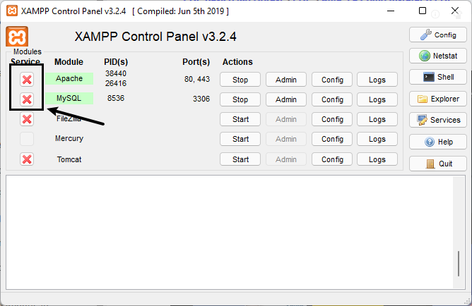
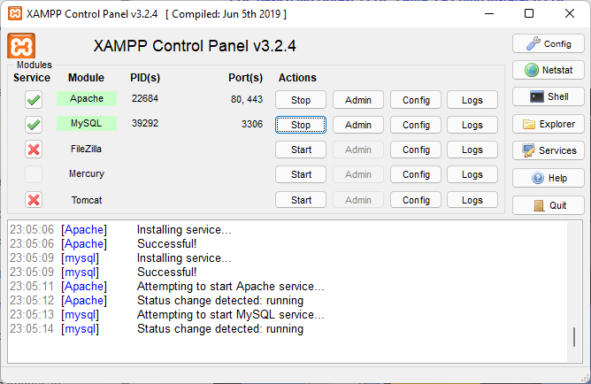

# 1. History of PHP

After internet in 1997 the WWW was born.

Along with it, came HTTP, HTML and PHP.
HTTP and HTML work together for communication between servers and clients;

## 1990:

* HTTP - Hyper Text Transference Protocol. Take a copy of html or any file in the server and transfer to client.  
  By Timber Lee.

## 1993

Rasmus Lerdorf:

* *If we (server) want to know how many people are visiting my site?*

* Creates a tool called **P**ersonal **H**ome **P**age Tools

### PHP 1

* Initially PHP 1 wasn't a language, but a simple interface.

* The functions were made in Pearl (in use until today).

## 1995

### PHP 2

* Interpret forms;

* Renamed to **P**ersonal **H**ome **P**age **F**orms **I**nterpreter

* PHP is still considered a simple CGI, not a language

## 1996

* PHPFI became open to other programmers;

* PHPFI can access database;

* Other programmers adding functions to PHPFI;

## 1997

* Netcraft - 70% of servers were using PHPFI;

* Seev Suraski, Andi Gutmans refactored PHPFI to became more like a language;

### PHP 3

* PHP renamed to **P**HP **H**ypertext **P**rocessor (Recursive acronymum)

## 1999

* 10% of all sites used PHP;

## 2000

* PHP 4

## 2004

### PHP 5 (5.5)

* 32 versions and 1k security fixes

* Still have problems with Unicode

## 2013

* PHP are used in 75% of servers

* http://museum.php.net - 

* PHP mascot is an elephant because the acronym kind of looks like one:

  
  

Nowadays there are frameworks and tools to create sites with PHP, no code needed! Sites like:

* Complete sites - Wordpress, Joomla, Drupal;
* eShop - Magento, Prestashop;
* Manage company - Sugar CRM;
* Colaborative network - MediaWiki (Wikipedia);
* Social media - Elgg
* Forums - PHP bb
* Education - mundo (?)

Zend is a company created by Zeev and Andi, creators of PHP3. It works on improvements of PHP.

# 2. How PHP works

Function of main web languages:

* HTML for content
* CSS for style
* JS for interactivity
* PHP for functionality


The server send HTML to client.

The client interpret HTML and communicate with server.

## Client side

* The client have most of the work;
* Everything works on client;
* The server only send the files.

## Server side

* The server uses PHP to interpret data and then send an HTML, or other files, to client;
* Apache is used as interpreter of PHP.

The interpreter is used to access database, among other things.

* The server have most of the work

## Technologies, server side, similar to PHP:

* ASP (Microsoft .NET)
* JSP
* Ruby
* etv

## Create local server

### Windows:

* [Download WAMP](https://www.wampserver.com/en/) (**W**indows **A**pache **M**ySql **P**HP);

* Or [download XAMPP](https://www.apachefriends.org/pt_br/index.html) instead.
  
  Powershell:

  ```powershell
  winget install xampp
  ```

  > I recomend to run XAMPP as admin.

* [Download EasyPHP](https://www.easyphp.org/)
### Linux:

* LAMP server:

  Debian distros:

  ```bash
  sudo apt install lamp-server
  ```

  > You can also find in app stores or look for tutorials out there.

### macOS:

* [Download MAMP server](https://www.google.com/search?client=firefox-b-d&q=mamp+server).

## Course content

* [See all the content here!](https://www.cursoemvideo.com/curso/php-basico/aulas/php/modulos/conteudo-para-o-curso-de-php/)

Honestly, once you have been installed your XAMPP or similar servers, you just need click two buttons to check and install these modules:



> Click on the :x: button to install each one.

After that, run again and that's it!



## PHP basic syntax

It's like HTML, and you can mix HTML inside PHP, but not the opposite.  
You can add php inside php as well.

Note that HTML interpreters doesn't run PHP, but you can rename a `.html` file to `.php`.  
That way the PHP preprocessor will interpret it as PHP.

## The PHP supertag:

```html
<?php
  // php code here
?>

<?php //php code here// ?>
```

### Correct usage:

The php supertag always start with `<?php`, all together!

Works:

```html
    <p><?php echo "no spacing"?></p>
    <p><?php echo "Space on the right" ?></p>

```

Desn't work:

```html
    <p><? php echo "space on the left"?></p>
```
* In this case, the PHP runs HTML with inline PHP.

## Simple PHP script:

```php
<?php
  echo "hello world"

// the end of the tag is optional
?>
```

## PHP with HTML:

```html
<!DOCTYPE html>
<html>
  <head>
      <title>How to put PHP in HTML - Simple Example</title>
  </head>

  <body>
      <h1><?php echo "Hello world, from server side!" ?></h1>
  </body>
</html>
```

## Your browser receives only the HTML page

Note that your browser only receives the already processed HTML, not the original with inline PHP.

If you write:

```html
<h1>
  <?php echo "Hello world" ?>
</h1>
```

Your browser receives:

```html
<h1>Hello world</h1>
```

* In conclusion: to learn PHP you must know how HTML works.
## Source

* [Apache: Inline PHP not working on Linux - StackOverflow](https://stackoverflow.com/questions/17185827/apache-inline-php-not-working-on-linux)

# 3. How to install PHP

> In XAMPP you just need to click the `x` buttons, and that's it:


The PHP is installed in MySQL module.

[See how to install in chapter 2](lesson-1-3.md#2-how-php-works):