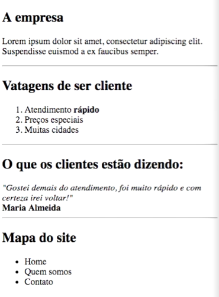

# Section 3 - HTML 5

## 8. What will be taught

* links

* Table

* Headers

* Forms


* In final project I shall be capable to create a simple site.
  
## 9. Web page structure, part 1

```html
<!doctype html>
<!-- doctype html is automatically set as html5 -->

<html>
  <!-- Main structure -->
  <head>
    <title>Title in browser</title>
  </head>
  <body>
    Body content
  </body>
</html>
```
    
## 10. Web page structure, part 2

### Identation

Identation is good practice in HTML, not obrigatory but recommended.

No identation:
```html
<div>
<p>paragraph</p>
</div>
```

Using identation:
```html
<div>
    <p>paragraph</p>
</div>
```

### Meta

Is the file format, normally `utf-8`.

```html
<meta charset="utf-8">
<meta charset="ascii">
```

### Head is optional in html5

```html
<!doctype html>
<!-- doctype html is automatically set as html5 -->

<html>
  <!-- Main structure -->
    <title>Title in browser</title>
    <!-- 'head' content -->
  <body>
    Body content
  </body>
</html>
```

## 11. Headers

### Solo tags

Earlier versions:

```html
<meta charset="utf8" />
<br/>
```

HTML5:

```html
<meta charset="utf8">
<br>
```

* Slash `/` is optional

Paired tags:

```html
<h1>Header</h1>
<div>division</div>
```

### Header types:

```html
<h1>Header 1</h1>
<h2>Header 2</h2>
etc...
```

## 12. Paragraph

Break line by grouping text:

```
<p>Line 1</p>
<p>Line 2</p>
<p>Line 3</p>
```

Simple line break:

```
Line 1<br>
Line 2
<br>
Line 3
```

* It doesn't matter if `<br>` is inside the line or above.

## 13. Bold

Not recommended anymore:

```html
Text with <bold>bold</bold> word.
```

Recommended now:

```html
Text with <strong>bold</strong> word.
```

### Italic

Not recommended anymore:

```html
Text with <i>bold</i> word.
```

Recommended now:

```html
Text with <em>bold</em> word.
```

* `em` from **embeleze**


### Underline:

```html
<u>Underline</u> text.
```

### Strike:

```html
<strike>Strike</strike> text.
```

## 14. Unordered list

```html
<!-- unordered list -->
<ul>
  <!-- list item -->
  <li>Item 1</li>
  <li>Item 2</li>
  <li>Item 3</li>
</ul>
```

Preview:

<ul>
  <li>Item 1</li>
  <li>Item 2</li>
  <li>Item 3</li>
</ul>

### List types

Circle: 

```html
<ul type="circle">
  <li>Item 1</li>
  <li>Item 2</li>
</ul>
```

<ul type="circle">
  <li>Item 1</li>
  <li>Item 2</li>
</ul>

Square: 

```html
<ul type="square">
  <li>Item 1</li>
  <li>Item 2</li>
</ul>
```

<ul type="square">
  <li>Item 1</li>
  <li>Item 2</li>
</ul>

### Comment:

```html
<!-- unordered list -->
```

* Not seen by browser and markdown reader.

## 15. Ordered list - Test

Make a site like this:



* [**Answer file**](test-15.html)

### Line separator:

```html
<hr>
```

 * `hr` from horizontal rule

### Ordered list:

```html
<ol>
  <li>item</li>
  <li>item</li>
</ol>
```

## 16. Images

```html
<!-- from link -->


<!-- local image -->

```

Preview:


* *Is recommended to use local images.

### Custom width in tags:

#### Automatic propotion:

```html
<!-- height is automatically proportional -->

<br>

```

Preview:


<br>


#### Custom proportion:

```html

```

Preview:


## 17. Link

```html
  <a href="https://www.udemy.com/course/web-completo">Site of this course</a>
  <br>
  <a href="test-15.html">Local html file</a>
```

Preview:

<a href="https://www.udemy.com/course/web-completo">Site of this course</a>
<br>
<a href="test-15.html">Local html file - test 15</a>

  > Link to local html didn't work on VSCode's markdown preview.

## 18. Table

```html
<table border="2px">
  <!-- table row (first) -->
  <tr>
    <!-- table header -->
    <th></th>
    <th>A</th>
    <th>B</th>
    <th>C</th>
  </tr>
  <tr>
    <!-- table data-->
    <td>1</td>
    <td>A1</td>
    <td>B1</td>
    <td>C1</td>
  </tr>
  <tr>
    <td>2</td>
    <td>A2</td>
    <td>B2</td>
    <td>C2</td>
  </tr>
  <tr>
    <td>3</td>
    <td>A3</td>
    <td>B3</td>
    <td>C3</td>
  </tr>
</table>
```

Preview (markdown):

<table border="2px">
  <!-- table row (first) -->
  <tr>
    <!-- table header -->
    <th></th>
    <th>A</th>
    <th>B</th>
    <th>C</th>
  </tr>
  <tr>
    <!-- table data-->
    <td>1</td>
    <td>A1</td>
    <td>B1</td>
    <td>C1</td>
  </tr>
  <tr>
    <td>2</td>
    <td>A2</td>
    <td>B2</td>
    <td>C2</td>
  </tr>
  <tr>
    <td>3</td>
    <td>A3</td>
    <td>B3</td>
    <td>C3</td>
  </tr>
</table>

## 19. More about table

### Custom width (for any tag)

#### 100% browser width:

```html
<table width="100%">
  ...
</table>
```

#### defined width:

```html
<table width="300px">
  ...
</table>
```

#### Empty space:

```html
<table border="2px">
  <tr>
    <th></th>
    <th>A</th>
    <th>B</th>
    <th>C</th>
  </tr>

  <tr>
    <td>1</td>
    <td>A1</td>
    <td>B1</td>
    <td>C1</td>
  </tr>
  <tr>
    <td>2</td>
    <td>A2</td>
    <td>B2</td>
    <td>C2</td>
  </tr>
  <tr>
    <td>3</td>
    <td>A3</td>
    <td>B3</td>
    <!-- empty cell here -->
  </tr>
</table>
```

#### Cell occupying 2 columns:

```html
<table border="2px">
  ...
  <tr>
    <td>3</td>
    <td>A3</td>
    <td colspan=2>B3 and C3</td>
  </tr>
</table>
```


#### Cell occupying 2 lines:

```html
<table border="2px">
  ...
  <tr>
    <td rowspan=2>2 and 3</td>
    <td>A2</td>
    <td>B2</td>
    <td>C2</td>
  </tr>
  <tr>
    <!-- 2 and 3 here -->
    <td>A3</td>
    <td>B3</td>
    <td>C3</td>
  </tr>
</table>
```

> Note that `rowspan=2` and `rowspan="2"` are the same.

<!-- TODO: 20. Form -->